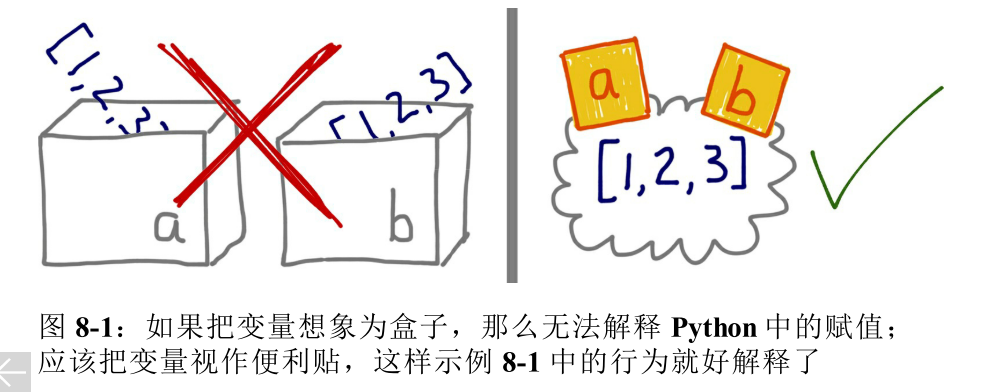

# 爬取用户的关注用户s

v0.0.3 - 爬取指定 user id 的所有 follow 的 user-ids.

## *Overview*

[TOC]

## Contents

  N/A

## Summary

N/A

## TODO

- [ ] selenium browser close issue, 不能关闭太早，也不能不关闭。
  1. 使用 with 实现上下文，创建实例的函数退出后，就能够自动关闭是一种方式。
  2. 类内部重写 del 调用的特殊方法来 browser.close() 是一种简单的 solution.

  > 关于 selenium 这方面的使用，翻阅书籍！
  >
  > 之前看了 *Test-Driven Development with Python* 之后，简单的 systemd + ngnix + guncorn 部署操作起来算是相当顺利了，如果没有这份参考，自己可能需要花很长时间去学习 wgsi 相关的知识。这就是 SOP 的作用。
  >
  > 所以，对于 selenium 的 browser.close() 问题，专门讲 selenium 的书籍肯定会涉及到，先学习在使用，不要蒙头尝试！！！

- [ ] 使用装饰器将继承HomePage 的子类需要使用到 pagesource 的方法重构。

- [ ] 实现上面的 browser.close() 时机后，重写 UserData 类的并发机制！

  不要过早优化！现在如果使用新的 have page source 方式，虽然不能并发

  （要想也可以，在实例化两个 `<Home/Blog>Page` 之后并发 get page source），但是目前这种设计已经是比较合理的了。

- [x] 一处隐藏 bug, selenium 调用 PhantomJS 如果启动后抛出异常，那么将不会关闭浏览器（browser.close()）。`try:..except:..finally:...`

  > 到了这个位置，fix bug， enhance feature 这些动作已经有些被测试拖了！ 
  >
  > CSDN-Data v0.0.3 之后开始写测试？


## Note

n/a


## Change Log (2018)

### Oct/27 获取 user id 的关注用户

#### 14:17 爬取 user id 主页上的关注用户 id

start about 15:--, done on 18:07

```python
def getFollows_of_theUserID(user_id, browser_path=DEFAULT_BROWSER_PATH + DEFAULT_BROWSER_NAME):
    """
    -[x] 获取到的是粉丝列表，不是关注列表！！！
    """
    try:
        # get user id home page source code
        # browser = webdriver.PhantomJS(executable_path=browser_path)
        browser = webdriver.Edge()
        browser.get("https://me.csdn.net/" + user_id)
        follows = browser.find_elements_by_tag_name("span")
        for follow_tag in follows:
            # if __debug__: print(follow_tag.text)
            if "关注" in follow_tag.text:
                follow_tag.click()
                break
        sleep(1)
        pagesource = browser.page_source
        browser.close()

        # get data from home page source code
        csdnUserHPSoup = BeautifulSoup(pagesource, 'html.parser')

        userfollowsDict = dict()
        fans_ul_list = csdnUserHPSoup.findAll('ul', {'class': 'tab_page'})
        if __debug__: print("len of 'class: tab_page': ", len(fans_ul_list))
        for fans_ul in fans_ul_list:
            # if __debug__: print(fans_ul, '\n\n\n')
            # if fans_ul.findAll("ul", {'style': "display: block;"}):
            if "block" in str(fans_ul):
                strictlyUserFollowsInfoTag = fans_ul

        for tagli in strictlyUserFollowsInfoTag.findAll('li'):
            for a_tag in tagli.findAll('a'):
                if "fans_title" not in str(a_tag): continue
                userfollowsDict[a_tag.string] = a_tag.attrs['href']

        def clean_follows_userid_dict(dict_):
            # user id must have not '\n', ' ', '\t', etc...
            for k, v in dict_.items():
                del dict_[k]
                k = k.replace('\n', '').replace(' ', '').replace('\r', '')
                v = v.replace('\n', '').replace(' ', '').replace('\r', '')
                # only user-id be needed, no need url:
                dict_[k] = v.replace('https://me.csdn.net/', '')
            return dict_

        userfollowsDict = clean_follows_userid_dict(userfollowsDict)

        if __debug__:
            print("follows of %s:\n" % user_id, userfollowsDict, '\n')
        return userfollowsDict
    except Exception as err:
        print("getFollows_of_theUserID > error: ", err, file=sys.stderr)
        raise Exception
```

##### 18:44 更新代码细节

因为 “粉丝” 和 “关注” 的页面元素十分接近。所以上面使用 `style="display: block;"` 来进一步过滤来获取 关注的 `<ul>`

**陷阱：beautiful soup 在 .findAll() 中，过滤并不准确？**

> ```
> fans_ul_list = csdnUserHPSoup.findAll('ul', {'class': 'tab_page'})
> if __debug__: print("len of 'class: tab_page': ", len(fans_ul_list))
> ```
>
> 打印处理啊的 length 居然是 2 ！
>
> 粉丝的 class: "tab_page clearfix"; 关注的 class: "tab_page"; 这一点原因还不确定。

使用 selenium 来实现点击 ***[关注]*** 这个标签，关注的 style 就会变成 **“display: block;”**！然后在下面的 *另一个陷阱* 中，判断 tag 中是否存在 block 来精确过滤。

```python
        follows = browser.find_elements_by_tag_name("span")
        for follow_tag in follows:
            # if __debug__: print(follow_tag.text)
            if "关注" in follow_tag.text:
                follow_tag.click()
                break
```

**另一个陷阱：**

beautiful soup 的 tag 使用 `in` 操作居然既不报错也不自动调用 `__str__` ， 使用 `print( <tag> )` 就能看到整段该 tag 的 html 文本，但是使用 `if <string> in <tag>:` 不会返回 True！（string 在该 tag 的 html 中的情况），和预期的有些不一样，那么 beautiful soup 实现的 `in` 是 tag in tag ？

总之，如果判断字符串是否在该 tag 的 html 中，必须要显式地调用 str()：

`if "block" in str(fans_ul):`

------

现在，来谈谈更新代码。

1. 先将这两行换为一行：

```
        follows = browser.find_elements_by_tag_name("span")
        for follow_tag in follows:
```

`for follows in browser.find_elements_by_tag_name('span'): ...`


2.  过滤 follows `<ul>` 的代码有点儿长，精确过滤是一个参见的需求，

> reference: *python 网络数据采集* &2.6
>
> `findAll(tag, attributes, recursive, text, limit, keywords)`
>
> `find(tag, attributes, recursive, text, keywords)`

使用 `lambda` 表达式在 `.findAll()` 中进一步过滤：

```python
        strictlyUserFollowsInfoTag = csdnUserHPSoup.find(
            lambda tag: "block" in str(tag),  # python 网络数据采集 & 2.6 !!!
            {'class': 'tab_page'}, )  # 并不确定 tag 使用函数之后，attributes 是否还有起到作用？

```

可以看出来，原本至少需要两行（使用列表推导）的代码，可以缩减成一行（去掉注释）。


#### 20:20 重构爬取user id首页

##### 分析

因为现在 **获取 UserID 的 VisualData: 访问量，排名，原创量，etc..**

  和

**获取 UserID 的 user_id of follows , (fans if need)**

都需要获取一下 `https://me.csdn.net/<user id>` 页面 html source code.

所以，如果分开两个类分别获取一下 html page source (page source 使用的是浏览器右击-> view page source 的统一描述)，就有些浪费资源了。

如果放在同一个类中，毕竟两者获取的信息不同，况且后面还要获取文章列表...

##### 设计

所以设计方案是这样的：

```
          +--------------------------+
          |        home page         |
          +--------------------------+
          |  https://me.csdn.net/    |
          |         user id          |
          +--------------------------+
          |   get_pagesource()       |
          +--------------------------+
       -/,                  ,\-
       /                      \
      /                        \
+-------------------+      +-------------------+
| CrawlerVisualData |      | CrawlerSocialData |
+-------------------+      |  (social of CSDN) |
|  pagesource       |      +-------------------+
|   user id         |      |    pagesource     |
|   <data dict>     |      |       user id     |
+-------------------+      +-------------------+
| syncCSDNData()    |      | get_follows()     |
+-------------------+      +-------------------+

```

~~上面没有继承关系，因为集成关系也无法传递 page source，所以，直接使用~~

上面继承关系， 重写`__init__` 成`__init__(user_id, pagesource=None, ..)` , 这样保证在没有实例化 HomePage 对象，然后传递 pagesource 给子类的时候，之类也可以根据 `pagesouce is None` 判断出来。

`page is None` 的话，就要重新调用父类的 `get_pagesource()` 来 set pagesource 的值。

> 1. 其中， get_pagesource() 总是 **close** selenium 的 browser！ 等未来对上面 [TODO](#TODO) 的方案实现之后，在 `__init__()` 中可以考虑也传递一个 selenium 的 browser 。
>
>    > selenium 没有 browser 变量，对象等等，我个人喜欢将 `selenium.webdriver.<BrowserName>()` 绑定到 browser 变量。
>    > 
>    >
>    > <p align="middle">当我说到绑定到变量，脑海中浮现的画面</p><p align="middle">《流畅的 python》 => &8.1 变量不是盒子</p>
>
> 2. `if pagesource is None: do get_pagesource()` 这一在子类中的行为，不用每个需要使用到 page source 的方法都写一遍。考虑使用装饰器来自动化这段代码的判断和行为。
>

##### 开始重构

###### 先对原本的 visual data 的数据获取类（PersonCSDN）调整

```python
from selenium.common.exceptions import WebDriverException

class HomePage(object):
    def __init__(self, user_id):
        self.PERSONAL_HOME_PAGE_URL = "https://me.csdn.net/"

    def getHomePageURL_by_UserID(self):
        return self.PERSONAL_HOME_PAGE_URL + self._id

    def getHomePageHTMLText(self):
        try:
            browser = webdriver.PhantomJS(executable_path=self.browser_path)
            browser.get(self.getHomePageURL_by_UserID())
            pagesource = browser.page_source
            browser.close()
            return pagesource
        except WebDriverException as err:
            print("selenium > browser issue?：", err, file=sys.stderr)
            raise EnvironmentError  # sys.exit() 退出不合理,
        except Exception as err:
            print("产生异常：", err, file=sys.stderr)
            raise Exception         # 这样可能使调用该类的后台程序整个崩溃。

class PersonCSDN(HomePage, AttrDisplay):
    def __init__(self, userid, doDebug=False,
                 browser_path=DEFAULT_BROWSER_PATH + DEFAULT_BROWSER_NAME,
                 pagesource=None):
        super().__init__(userid)
        self._id = userid  # CSDN user ID
        self.browser_path = browser_path
        self._doDebug = doDebug
        self._hpHTMLData = pagesource      # Home Page HTML Data
        self._csdnc_bloglevel = -1         # CSDN 博客等级
        [...]

    def _setUserInformation(self):
        [...]

    def syncUserData(self, return_dict=None):
        if self._hpHTMLData is None:  # 考虑使用装饰器自动化这段操作
            try:
                self._hpHTMLData = super().getHomePageHTMLText()  # 父类方法
            except Exception:
                raise Exception
        else:
            pass
        self._setUserInformation()

        # support multiprocessing
        if return_dict is not None:
            [...]
```

重构的方法都在上面代码里了，其中有三处主要改动要注意，一是 子类要调用父类 `__init__` ；二是 之类的 `self._hpHTMLData = pagesource` 赋值实例化时传递进来的参数；三是获取数据的时候，如果 二中 page source 为 None， 则调用父类方法来获取 html page source.

这个重构目前做到了完全向前兼容。可以继续重构获取 user id of follows 的方法了。

> 上面的代码有一些不完善的地方，比如 父类的 self.browser_path, self._id;
>
> 因为没有实例化 父类，然后使用该实例调用父类的方法，所以没有发现这个问题！
>
> 也就是说，上面的重构是不向前工作的，它只是向后兼容。
>
> 子类中调用父类，父类使用 `self._id` 如果它自己不存在，就会使用子类的 `self._id` 所以之前它可以工作，这一点的修复，在下面重构中解决。

###### 重构 `getFollows_of_theUserID()` 方法

调整 父类 以适应 get follows 方法的需要：

```python
class HomePage(object):
    def __init__(self, user_id,
                 browser_path=DEFAULT_BROWSER_PATH + DEFAULT_BROWSER_NAME):
        self._id = user_id
        self.PERSONAL_HOME_PAGE_URL = "https://me.csdn.net/"
        self.browser_path = browser_path

    def getHomePageURL_by_UserID(self):
        return self.PERSONAL_HOME_PAGE_URL + self._id

    def getHomePageHTMLText(self):
        try:
            browser = webdriver.PhantomJS(executable_path=self.browser_path)
            browser.get(self.getHomePageURL_by_UserID())
            for follow_tag in browser.find_elements_by_tag_name("span"):
                # if __debug__: print(follow_tag.text)
                if "关注" in follow_tag.text:
                    follow_tag.click()
                    break
            pagesource = browser.page_source
            browser.close()
            return pagesource
        [...]
```

注意到 line 15~19 做了调整，为了适应 `SocialData(HomePage)` 子类的需要，因为这个修改对其它类是完全没有影响的（最多就是多执行了一些操作）。

line 4, line 6 针对上面提到的问题做了调整！

将 getFollows_of_theUserID() 方法在 SocialData 类中实现：

```python
class SocialData(HomePage):
    def __init__(self, user_id,
                 browser_path=DEFAULT_BROWSER_PATH + DEFAULT_BROWSER_NAME,
                 pagesource=None):
        super().__init__(user_id, browser_path)
        self.pagesource = pagesource

    def getFollows(self):
        if self.pagesource is None:  # 考虑使用装饰器自动化这段操作
            try:
                self.pagesource = super().getHomePageHTMLText()  # 父类方法
            except Exception:
                raise Exception
        try:
            # get data from home page source code
            csdnUserHPSoup = BeautifulSoup(self.pagesource, 'html.parser')

            userfollowsDict = dict()
            strictlyUserFollowsInfoTag = csdnUserHPSoup.find(
                lambda tag: "block" in str(tag),  # python 网络数据采集 & 2.6 !!!
                {'class': 'tab_page'})  # 并不确定 tag 使用函数之后，attributes 是否还有起到作用？

            for tagli in strictlyUserFollowsInfoTag.findAll('li'):
                for a_tag in tagli.findAll('a'):
                    if "fans_title" not in str(a_tag): continue
                    userfollowsDict[a_tag.string] = a_tag.attrs['href']

            # user id must have not '\n', ' ', '\t' etc...
            def clean_follows_userid_dict(dict_):
                for k, v in dict_.items():
                    del dict_[k]
                    k = k.replace('\n', '').replace(' ', '').replace('\r', '')
                    v = v.replace('\n', '').replace(' ', '').replace('\r', '')
                    # only user-id be needed, no need url:
                    dict_[k] = v.replace(self.PERSONAL_HOME_PAGE_URL, '')
                return dict_
            userfollowsDict = clean_follows_userid_dict(userfollowsDict)

            if __debug__:
                print("follows of %s:\n" % self._id, userfollowsDict, '\n')
            return userfollowsDict
        except Exception as err:
            print("SocialData> getFollows> error: ", err, file=sys.stderr)
            raise Exception
```

注意到 line 35， line 40 的修改，这两个变量都是从父类继承的！

 其它的大多不变。如果实例化的时候传递 pagesource 变量，则能够节省重新获取的时间。

测试代码 ：

```python
if __name__ = "__main__":
    if True:
        havePageSource = True
        try:
            if havePageSource:
                csdn_homepage = HomePage(sys.argv[1], browser_path=sys.argv[2])
                pagesource = csdn_homepage.getHomePageHTMLText()
                # here is PersonCSDN handler.

                csdn_userid_socialData = SocialData(
                    sys.argv[1], pagesource=pagesource)
                print(csdn_userid_socialData.getFollows())
            else:
                csdn_userid_socialData = SocialData(sys.argv[1], browser_path=sys.argv[2])
                print(csdn_userid_socialData.getFollows())
        except IndexError:
            print("usage: %s <user id> <browser path>" % sys.argv[0], file=sys.stderr)
            sys.exit(1)

```

运行测试：

```powershell
(CSDN) D:\NEW\code-repo\Crawler\CSDN\MyInfo_Visualization>
python personalProfile.py qq_29757283 C:/bin/phantomjs-2.1.1-windows/bin/phantomjs.exe

follows of qq_29757283:
 {'逆风微光': 'dpsying', '张飞的猪': 'u014470784', 'zjjdyb': 'zjjdyb', 
 'who538592': 'who538592', '王大军9527': 'hui_love2046', 'GoRustNeverStop': 'weiyuefei'}

{'逆风微光': 'dpsying', '张飞的猪': 'u014470784', 'zjjdyb': 'zjjdyb', 
'who538592': 'who538592', '王大军9527': 'hui_love2046', 'GoRustNeverStop': 'weiyuefei'}

(CSDN) D:\NEW\code-repo\Crawler\CSDN\MyInfo_Visualization>
```

>  使用 `python -O <userid> <browser_path>` 可以除去 line 4~7 的输出。
>
> 因为它们使用了 `if __debug__: ...` 判断条件

重构完成！

<p align="right">2018/Oct/27 22:55</p>

#### 23:20 继续重构 Blog Page

blog page 当前主要用于获取粉丝数量，积分数量这两个信息。

但是以后会被用于获取博客文章的具体信息，因为主页上只是显示最近发表的 10~20 篇博客。

可以想象之后会加入一个 BlogData 类，用于获取第一层 blog 信息（关于层级，往深入的层级比如是 blog article 具体文本内容，评论内容，评论用户，CSDN 提供的关联 article 等等，但是我们目前不要去考虑这些）。

所以同样需要 blog page source，因此一个 BlogPage 类是有必要的！

> break, 先将 r820, r821 merge 到 CSDN-Data project 中。 -- 23:39 完成

BlogPage 类：

```python
class Page(object):
    def __init__(self, user_id,
                 browser_path=DEFAULT_BROWSER_PATH + DEFAULT_BROWSER_NAME):
        self._id = user_id
        self.browser_path = browser_path


class BlogPage(Page):
    def __init__(self, user_id,
                 browser_path=DEFAULT_BROWSER_NAME + DEFAULT_BROWSER_NAME):
        super().__init__(user_id, browser_path)
        self.PERSONAL_BLOG_PAGE_URL = "https://blog.csdn.net/"

    def getBlogPageURL_by_UserID(self):
        return self.PERSONAL_BLOG_PAGE_URL + self._id

    def getBlogPageHTMLText(self):
        try:
            browser = webdriver.PhantomJS(executable_path=self.browser_path)
            browser.get(self.getBlogPageURL_by_UserID())

            pagesource = browser.page_source
            browser.close()
            return pagesource
        except WebDriverException as err:
            print("selenium > browser issue?：", err, file=sys.stderr)
            raise EnvironmentError  # sys.exit() 退出不合理,
        except Exception as err:
            print("产生异常：", err, file=sys.stderr)
            raise Exception         # 这样可能使调用该类的后台程序整个崩溃。
[...]

class HomePage(Page):[...]
```

> HomePage 继承 Page  的代码修改就不放上来了，基本上只修改了 init，和 BlogPage 的 `__init__()` 一样。

可以看到，其中也就是把几个基本变量： user_id; browser_path 这些放到 BlogPage 类中，并且该类有获取 blog 首页源代码的方法。

BlogPage 获取 data 的具体子类：

```python
class PersonBlogCSDN(BlogPage):
    def __init__(self, user_id, doDebug=False,
                 browser_path=DEFAULT_BROWSER_PATH + DEFAULT_BROWSER_NAME,
                 pagesource=None):
        super().__init__(user_id, browser_path)
        self._hpHTMLData = pagesource
        ''' 所有文章 # 同级子类来处理文章data？
        ## list 内部是单独文章结构：
        ##    文章名，阅读量， 评论， 点赞， 日期，“属性（分类）”
        '''
        self._articles = list()
        self._fans = 0              # 粉丝
        self._follows = -1          # 关注
        self._beLiked = 0           # 总 "喜欢"(点赞)
        self._beCommented = 0       # 总 “评论”
        self._beAccessed = 0        # 总访问量
        self._membPoints = 0        # CSDN 积分
        self._rank = 0              # 排名
        self._doDebug = doDebug
        if __debug__:  # 后期将会找时间，将所有使用 doDebug 的地方去除
            print("running PersonBlogCSDN __init__", file=sys.stderr)

    def __str__(self): [...]

    def _rmUneccessaryChar(self, _dict): [...]
    def _setUserGradeBox(self, userGradeBoxTag): [...]
    def _setUserInformation(self): [...]
    def _getMembPointsFromHTML(self):[...]

    def syncUserData(self, return_dict=None):
        if self._hpHTMLData is None:  # 考虑使用装饰器自动化这段操作
            try:
                self._hpHTMLData = self.getBlogPageHTMLText()  # 调用继承父类方法
            except Exception:
                raise Exception
        
        self._setUserInformation()

        # support multiprocessing
        if return_dict is not None:[...]

    def __getattr__(self, attrname): [...]

```

1. 将变量移动到 `__init__()` 特殊方法中，删除了一些在父类定义过的通用变量。

2. 删除了获取 url 和获取 blog page source 的方法，可以通过调用父类方法来获取。

   > 其中，super() 调用父类方法 还是 继承父类方法使用 self. 调用？ 
   >
   > 使用 self.func() 调用应该更加合理一些！ super() 是在重写父类方法的方法里面，需要调用父类方法的时候使用！
   >
   > 这里显式地和上面 PersonCSDN 类对比。因为之前在实现 PersonCSDN 的时候，在使用 `super().__init__()` 时不熟悉，一处调用父类方法，就失误的到处调用了。

3. 同之前一样，line 31~36 判断是否有给予已经获取到的 pagesource。

向前兼容测试完成

<p align="right">2018/Oct/28 00:40</p>

#### Oct/28 00:42 使用重构后的方式并发

一个是为了测试向后功能可用，一个是为了将这种方式有效的利用起来。

修改 UserData 类的 `__init__()` 方法：

```python
class UserData():
    [...]
    def __init__(self, userid, doDebug=False,
                 browser_path=DEFAULT_BROWSER_PATH + DEFAULT_BROWSER_NAME,
                 home_pagesource=None, blog_pagesource=None):
        self._id = userid
        self.doDebug = doDebug
        self.user_homepage_data = PersonCSDN(
            self._id, browser_path=browser_path, pagesource=home_pagesource)
        self.user_blogpage_data = PersonBlogCSDN(
            self._id, browser_path=browser_path, pagesource=blog_pagesource)
```

修改测试方法：

```python
def main(argc, argv):
    print("\nstart CSDN Data at time: ", ctime(), '\n')
    USER_ID = "qq_29757283"
    try:
        if argv[1] == 'single':  # single processing
            # 回归测试！
            [...]
        elif argv[1] == 'multi':
            if True:
                csdn_homepage = HomePage(USER_ID, browser_path=sys.argv[2])
                home_pagesource = csdn_homepage.getHomePageHTMLText()

                csdn_blogpage = BlogPage(USER_ID, browser_path=sys.argv[2])
                blog_pagesource = csdn_blogpage.getBlogPageHTMLText()
                myCSDNInfo = UserData(USER_ID, doDebug=False,
                                      home_pagesource=home_pagesource,
                                      blog_pagesource=blog_pagesource)
            else:
                myCSDNInfo = UserData(USER_ID, doDebug=True,
                                      browser_path=argv[2])
            dict_ = myCSDNInfo.quikSyncCSDNData()
            print(dict_)
        else:
            print("only support multi/single")
```

这个测试证明了向后兼容可以通过，

**但是也暴露了一个问题，如果使用这种方式，就不能使用 quikSyncCSDNData 来并发请求网络数据，但是请求网络数据才是真正耗时的！**

这个 bug 先不解。目前 UserData 已经修改，所以 commit 一次。

<p align="right">2018/Oct/28 01:03</p>

**针对上面说得暴露并发请求网络资源问题，check [TODO](#TODO) 第三点！**


### Oct/28 

#### 13:26 fix browser close 隐藏bug

```python
    def getHomePageHTMLText(self):
        try:
            if __debug__:
                browser = webdriver.Firefox()
            else:
                browser = webdriver.PhantomJS(executable_path=self.browser_path)
            browser.get(self.getHomePageURL_by_UserID())
            for follow_tag in browser.find_elements_by_tag_name("span"):
                # if __debug__: print(follow_tag.text)
                if "关注" in follow_tag.text:
                    follow_tag.click()
                    break
            pagesource = browser.page_source
        except WebDriverException as err:
            print("selenium > browser issue?：", err, file=sys.stderr)
            raise EnvironmentError  # sys.exit() 退出不合理,
        except Exception as err:
            print("产生异常：", err, file=sys.stderr)
            raise Exception         # 这样可能使调用该类的后台程序整个崩溃。
        finally:
            if 'browser' in locals():
                browser.close()
        return pagesource
```

之前 try:...except:... 使用的方式不够合理，所以上面做了修改！

#### 13:55 fix 了一个新发现的 bug

从 blog page 获取用户的积分 value, 如果积分超过一万，显示"1万+", 之前没有针对这个做处理！

所以粉丝的数量也是有可能出现这个问题的（不过不解也没有关系，粉丝和关注的数量，最后都会从 home page 获取，home page 显示的数量是精确的值）。

fix:

```python
class PersonBlogCSDN(BlogPage):
    [...]
    def syncUserData(self, return_dict=None):
        if [...]
            [...]
                return_dict["fans"] = self._fans
                return_dict["follows"] = self._follows

                highOrder = re.sub("\D", "", self._membPoints)
                if "万" in self._membPoints: return_dict['membPoints'] = int(highOrder) * 10000 + 9999
                else:                        return_dict['membPoints'] = int(highOrder)
          
    def __getattr__(self, attrname):
        [...]
        elif attrname == 'membPoints':
            highOrder = re.sub("\D", "", self._membPoints)
            if "万" in self._membPoints:
                return int(highOrder) * 10000 + 9999
            else:
                return int(highOrder)
        [...]
[...]
```

这样目前就 fix 掉了这个问题！


#### 17:35 同上面的 '万' bug

还没来得及转移到获取 home page 的粉丝数量，就遇到这个问题。

一个所谓“CSDN网络编辑部编辑” 有超过一万的粉丝！

把 fix '万' 的代码提取出来成为一个通用函数。然后 fix 了这个问题。


