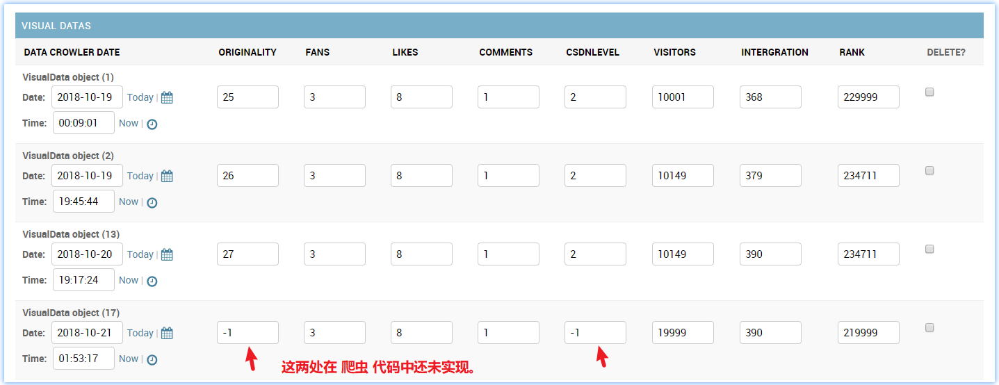
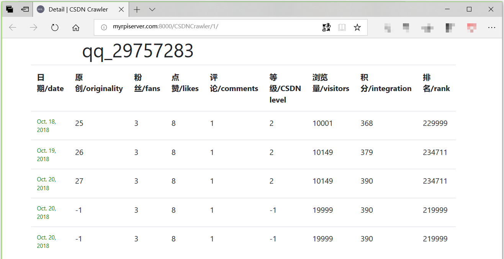
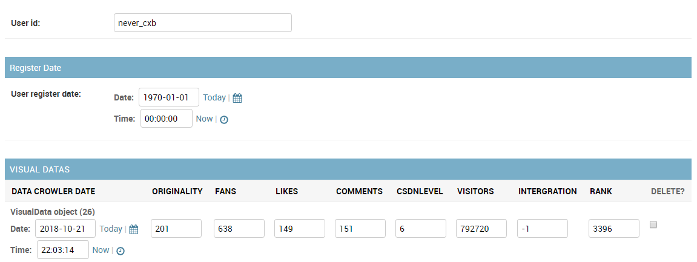
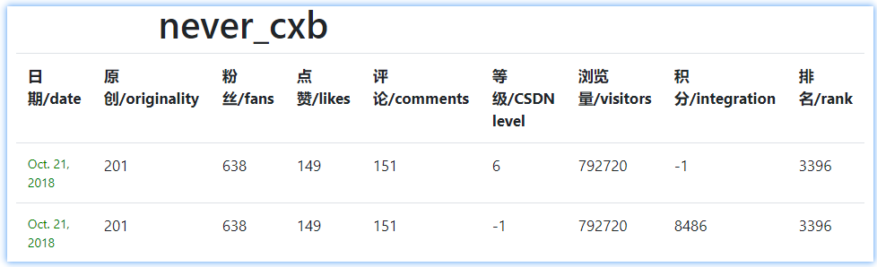

# v0.0.2 后台爬虫-数据入库

v0.0.2 主要目的调整爬虫程序，和 views.py 调用爬虫的“页面”接口处的代码。

调用爬虫抓取到数据后，要存入数据库。

要实现一定程度的自主爬虫（后台定时周期执行）。

## *Overview*

[TOC]

## Contents

  N/A

## Summary

```shell
$ ../virtualenv/bin/python manage.py runserver.com \
0.0.0.0:8000 > ./log/<date>.log 2>&1 &
[1] <the pid it run backend>
$ 
$ exit  ## can exit now.
$ 
$ ### another ternimal
$ tail -f ./log/<date>.log  ## can view the log in time
...
```


## TODO

- [x] 多~~线程~~进程同时爬取 用户主页 和 用户blog主页

- [x] 请求头部完全模拟浏览器，避免被识别出是 robot！

  使用 selenium + 无头浏览器实现（PhantomJS）

- [ ] 数据库 - Article 表： UserID <--- Article ID  <----  VisualArticle

- [ ] PhantomJS 保留在后台，想要打开新 user id 或下一次，等效于在“新标签”页打开的效果-速度

- [x] [Bug Detect] detail 页面的日期显示不正确！不是 timezone now？- 改为 24 小时制的显示，非 a.m; p.m.

  [Bug Fixed]  {{ instance.date }} => {{ instance.date |date"Y-m-d H:i:s" }}

- [ ] shelve 保存 follows user id 数据，进程不安全，如果后面多进程还是这么使用，一定要上锁！


  ​     


## Note

a. 爬虫程序：

  在 `Trunk/Learning/Crawler/CSDN/MyInfo_Visualization/` 路径下开发 CSDN 爬虫程序，merge 过去。

b.  django-with-CSDN-data:

  (Django 请求、处理、分析数据程序)

  只是复制处理爬取到的数据，以及和后台定时请求的任务逻辑。数据分析，发送下一个任务给定时请求的 client 后台。

- 响应从客户端请求页面的周期定时激活
- 请求、处理、分析数据
- 发布新任务给客户端

c. 定时，周期激活数据更新，处理程序

  根据任务集合（user id set），定时处理一个任务，请求页面以激活 django 以数据形式处理该任务。

  获取一个新的任务来自页面响应，自增长用户 ID 集合。

## Change Log(2018)

### Oct/20:21 数据入库

使用原本很早之前做好的爬虫程序，爬到了一个基本的数值数据，现在在 views.py 调用爬虫程序之后，获得到了数据，要将数据存入数据库。

因为之前爬虫程序期望能够封装，所以对用户基本数据（attribute）的获取，也参照着封装来。

所以，实现一个特殊方法 `__getattr__` 来回复预期会在 views.py 中调用爬虫程序之后，使用点操作获取爬取到的数据。

```python
import re
[...]

class PersonCSDN(object):
    [...]
    def __getattr__(self, attrname):
        if attrname == 'originality':
            print("WARNING: not achieve originality number yet!", file=sys.stderr)
            return -1  # 还未实现获取原创文章数量的代码。
        elif attrname == 'fans':
            return self._fans
        elif attrname == 'beLiked':
            return self._beLiked
        elif attrname == 'beCommented':
            return self._beCommented
        elif attrname == 'csdnLevel':
            print("WARNING: not achieve CSDN Level yet!", file=sys.stderr)
            return -1
        elif attrname == 'beAccessed':
            highOrder = re.sub("\D", "", self._beAccessed)
            if "万" in self._beAccessed:
                return int(highOrder) * 10000 + 9999
            else: return int(highOrder)
        elif attrname == 'membPoints':
            return self._membPoints
        elif attrname == 'rank':
            highOrder = re.sub("\D", "", self._rank)
            if "万" in self._rank:
                return int(highOrder) * 10000 + 9999
            else: return int(highOrder)
        else:
            raise AttributeError
```

其中，因为现在爬取的页面不是很正确（后来发现应该爬取的用户主页应该是 'https://my.csdn.net/<id>' 这个位置）。所以，有类似“1万+” 这样的数字出现在数据中。

使用 `resultDigit = re.sub('\D', '', sourceStr)` 的方式，获取到 string 的前面位置的数字，返回值实际上还是 string，只不过是纯数字的 string。使用 int() 转换。 `int(highOrder)*10000+9999` 简单地将不精确的排名设定为这个万位的最大值。

> reference: [Python3中字符串中的数字提取方法](https://www.cnblogs.com/Lucystonenix/p/5929931.html)

其中，有文章数量和 CSDN 等级（实际上是称为 博客等级）还没有在爬虫程序中实现。所以返回 `-1` 实际上 `-1` 也是使用 django 的 model 创建的数据库表的该列的默认值。


在 views.py 中，响应请求网页就开始运行爬虫程序，然后将爬到的数据入库，最后 response 请求爬取成功。其中，新增了数据入库部分代码，该处理请求的整个代码如下：

```python
def startcrawler(request):
    # do the crawler action
    USER_ID = "qq_29757283"
    myCSDNInfo = personalProfile.PersonCSDN(USER_ID, doDebug=True)
    print(myCSDNInfo, file=sys.stderr)

    userid = UserID.objects.get(user_id=USER_ID)  # 该用法没有问题。
    if doDebug: print("userid: ", userid)

    newVisualData = VisualData()
    newVisualData.user_id = userid
    newVisualData.originality = myCSDNInfo.originality
    newVisualData.fans = myCSDNInfo.fans
    newVisualData.likes = myCSDNInfo.beLiked
    newVisualData.comments = myCSDNInfo.beCommented
    newVisualData.csdnlevel = myCSDNInfo.csdnLevel
    newVisualData.visitors = myCSDNInfo.beAccessed
    newVisualData.intergration = myCSDNInfo.membPoints
    newVisualData.rank = myCSDNInfo.rank
    newVisualData.save()

    return HttpResponse("<html><head><title>CSDN Personal Profile Crawler</title></head>"
                        "<body><h1>Hello, you are in CSDN Personal Profile!</h1>"
                        "</body></html>")

```

运行请求网站的该网页来激活一个爬取数据入库动作：

`$ python runCSDNCrawler.py <this project running host machine ip>`

通过 admin 后台管理网页可以看到新增的一条数据：



再次运行，这次我们从 v0.0.1 结束时完成的网站 detail 页面查看数据表格：




### Oct/21 

在 CSDNVisualize > CSDNCrawler > MyInfo_Visualization > Doc > v0.0.2_user_personal_profile.md 可以看到，Oct/21/2018 更新正确的爬取 url 页面。

#### 22:-- 支持爬取其它用户ID的信息

*Note: 当前 revision 的代码在这个功能上有 bug， 如果使用这一版代码，要注意看下面说明。*

一、首先进入 `https://<CSDNVisualizeServer>/admin/` 管理页面，先手动创建一个新要爬取的用户 ID 比如：“never_cxb”。



点击下方的保存按钮，保证我们在 VisualData 表中新增一条数据的时候，可以使用外键关联到这个用户 ID 在的 UserID 表。

二、然后我们修改代码，使 client 通过 GET 请求的时候，带上请求的 USER ID；以及 server 可以知道现在需要“发起”爬取数据调用，爬取的数据是该 USER ID 的数据，然后对应地保存下来。

我们修改 请求的url从 

`'http://%s:8000/CSDNCrawler/startcrawler/' %  <WebServerIP>`

 更换为 

`'http://%s:8000/CSDNCrawler/startcrawler/?user_id=%s' % (<WebServerIP>, <UserIP>) `

修改 client 端代码：

```python
argc = len(sys.argv)
if argc < 2:
    print("Usage: %s <SERVER IP/Domain> [USER ID]" % sys.argv[0],
          file=sys.stderr)
    sys.exit(1)

try:
    startcrawlerurl = 'http://%s:8000/CSDNCrawler/startcrawler/?user_id=%s' % (
        sys.argv[1], sys.argv[2])
except IndexError:
    startcrawlerurl = 'http://%s:8000/CSDNCrawler/startcrawler/' % sys.argv[1]
```

然后修改我们修改 server 端代码：

```python
def startcrawler(request):
    # do the crawler action
    try:
        USER_ID = request.GET['user_id']
    except KeyError:
        print("WARNING: no 'user_id' in Request, crawler myself information!", file=sys.stderr)
        USER_ID = "qq_29757283"

    myCSDNInfo = personalProfile.PersonCSDN(USER_ID, doDebug=True)
    [...]
```

三、运行代码，查看效果

enable server `$ python manage.py runserver 0.0.0.0:8000`

run client `$ python runCSDNCrawler.py myrpiserver.com never_cxb`

没有错误，在网页上查看数据：



<p align="right">2018/Oct/21 22:28</p>

#### 22:57 suppor new USER ID

fix 新增用户 ID 不存在 UserID 数据库表中，在爬取数据后，新增 VisualData 表行的时候，外键关联错误的 issue

修改代码，目前简单点，对于不在 UserID 表中的 USER ID 就直接新增一个：

```python
    try:
        userid = UserID.objects.get(user_id=USER_ID)  # 该用法没有问题。
    except UserID.DoesNotExist:
        """
        userid = UserID(user_id=USER_ID)  # easyPSWD
        userid.save()              # SHA-1: 23ebe4691b2eac5b4cf35cd751db14058b023f05
        """
        userid = UserID.objects.create(user_id=USER_ID)  # TDDwithPython &5.6
```

> Reference: 
>
> [Django Official Tutorial]: r752;
>
> [Test-Driven Development with Python]: &5.6 p61(P92).

上面提供了两种建立新 UserID 行的方式，第二种不用调用 object.save() 。

<p align="right">2018/Oct/21 23:17</p>

#### 23:20 快速美化一下首页 User ID list

修改 index.html 页面,

使用了 .container 包住全部 content；使用 .col-md-offset-3 使不要贴在边缘，其它再对应调整了一下：

```html
{# CSDNVisualize/CSDNCrawler/templates/visualize/index.html #}
<!DOCTYPE html>
<html>
  <head>
    <!-- Required meta tags -->
    <meta charset="utf-8">
    <meta name="viewport" content="width=device-width, initial-scale=1, shrink-to-fit=no">

  <!-- Bootstrap CSS -->
  <link href="/static/bootstrap/css/bootstrap.min.css" rel="stylesheet" media="screen">

  <title>User ID List | CSDN Crawler</title>
</head>
<body>
<div class="container">
	<div class="row">
	<div class="col-md-6 col-md-offset-3">
		<div class="text-center">
		<h1>User ID List</h1>
		</div>
	</div>
	</div>

    <div class="row">
    <div class="col-md-6 col-md-offset-3">
		  
		    <ul class="list-group">
		    
		        <li class="list-group-item">
		        	<a href="/CSDNCrawler/{{ userid.id }}/">
		        		{{ userid.user_id }}</a></li>
		    
		    </ul>
		
		    <p>No CSDN account are available.</p>
		
	</div>
	</div>
</div>
</body>
</html>
```

<p align="right">2018/Oct/21 23:32</p>

### Oct/22

#### 21:40 添加字段到 UserID

添加 visit（浏览量），rank（排名）到 UserID 表，每次爬取 user_id 的时候，更新这两个字段。

这两个字段用来控制爬取的用户的优先级。（以后会用到）

##### 更新数据库

修改 UserID 表：

```python
class UserID(models.Model):
    user_id = CharField(max_length=64)
    register_date = DateTimeField(
        'user register date',
        default=datetime(1970, 1, 1, 0, 0, 0))
    # email = EmailField()
    # birthday

    """here field just only for crawler priority"""
    visit = IntegerField(default=-1)
    rank = IntegerField(default=-1)

    def __str__(self):
        return self.user_id
```

执行 makemigrations:

```shell
CSDNVisualize/ $ python manage.py makemigrations
Migrations for 'CSDNCrawler':
  CSDNCrawler/migrations/0003_auto_20181022_2148.py
    - Add field rank to userid
    - Add field visit to userid
CSDNVisualize/ $
```

执行数据迁移：

```shell
CSDNVisualize/ $ python manage.py migrate
Operations to perform:
  Apply all migrations: CSDNCrawler, admin, auth, contenttypes, sessions
Running migrations:
  Applying CSDNCrawler.0003_auto_20181022_2148... OK
CSDNVisualize/ $
```

##### 更新视图（目前仅后台管理部分）

```python
class UserIDAdmin(admin.ModelAdmin):
    fieldsets = [
        (None,            {'fields': ['user_id']}),
        ('Register Date', {'fields': ['register_date'],
                           # 'classes': ['collapse'],
                           }),
        ('last visit number', {'fields': ['visit']}),
        ('last rank', {'fields': ['rank']}),
    ]
    inlines = [VisualDataInline]
```

- [ ] 如何使 visit number 和 rank 在同一行不同列显示？

##### 更新数据入库代码

```python
def startcrawler(request):
    # do the crawler action
    try:
        USER_ID = request.GET['user_id']
    except KeyError:
    [...]

    userid.visit = myCSDNInfo.beAccessed
    userid.rank = myCSDNInfo.rank
    userid.save()

    newVisualData = VisualData()
    newVisualData.user_id = userid
    [...]
```


#### 22:XX 多进程爬虫

因为光是获取 VisualData 表的信息，就要获取两张 CSDN 页面，所以需要使用多进程优化一下。

（实际上多线程就可以，但是因为 Python GIL 关系，所以应用上是多进程）

调整了 爬虫端的代码，但是要能够用上多进程，需要进一步重构，所以这里先等一下。

### Oct/26 整合多进程爬虫

- [ ] 如何在 runserver 的时候，就将 CSDNCrawler > MyInfo_Visualization > personalProfile.py 需要使用到的库等东西加载到内存中，而非调用时 load

#### 00:5- 基于 r816（merge into r807-815）整合进去新开发的爬虫程序，带有多线程功能。

单线程基本不变的使用（使用 selenium + PhantomJS 等同于浏览器）：

```python
-   myCSDNInfo = personalProfile.PersonCSDN(USER_ID, doDebug=True)
+   myCSDNInfo = personalProfile.UserData(
+       USER_ID, doDebug=False, browser_path='/opt/phantomjs/bin/phantomjs')
+   myCSDNInfo.syncCSDNData()  # single thread version.
    print(myCSDNInfo, file=sys.stderr)
```

其它不变，直接使用即可。

多线程整合修改：

```python
    [...]
    myCSDNInfo = personalProfile.UserData(
        USER_ID, doDebug=False, browser_path='/opt/phantomjs/bin/phantomjs')
    if True:  # multiprocessing version:
        user_data_dict = myCSDNInfo.quikSyncCSDNData()
        print(user_data_dict, file=sys.stderr)

        userid.visit = user_data_dict['beAccessed']
        userid.rank = user_data_dict['rank']
        userid.save()

        newVisualData.user_id = userid
        newVisualData.originality = user_data_dict['originality']
        newVisualData.fans = user_data_dict['fans']
        newVisualData.likes = user_data_dict['beLiked']
        newVisualData.comments = user_data_dict['beCommented']
        newVisualData.csdnLevel = user_data_dict['csdnLevel']
        newVisualData.visitors = user_data_dict['beAccessed']
        newVisualData.intergration = user_data_dict['membPoints']
        newVisualData.rank = user_data_dict['rank']
        newVisualData.save()
```

测试可以工作！在 Ubuntu server 上工作大约 6~8s 一个 user id！

<p align="right">2018/Oct/26 01:10</p>

#### ~~21:-- 手动添加所有用户，定时爬取~~

`runCSDNCrawler.py` 中维护一个 user id list，用于定时爬取。

-- 初期工作，怎么简单怎么来！


### Oct/27 v0.0.2

#### 13:43 获取关注的 user id

先去 a. 部分实现爬取一个 user id 关注的所有 user id。

Oct/28 02:34  update: 获取 all user ids of follow 完成。已经 merge。 

#### 14:52 detail 页面 table 显示

调整 table 的列宽度

reference:

[bootstrapTable中的width值设置无效的问题的解决方法]: https://blog.csdn.net/wang1171405487/article/details/80667530
[bootstrap table th内容太多表格撑破(自动换行)]: https://blog.csdn.net/qq_30616169/article/details/55212284?locationNum=7&fps=1


### Oct/28 finish the v0.0.2

#### 02:36 user id 的所有 follows user id 保存到数据库

使用 shelve 保存数据。

效果：

```shell
$ python runCSDNCrawler.py myrpiserver.com qq_29757283
### server 的输出：
[...]
getFollows:  {'张飞的猪': 'u014470784', 'GoRustNeverStop': 'weiyuefei', 
'逆风微光': 'dpsying', 'zjjdyb': 'zjjdyb', '王大军9527': 'hui_love2046', 
'who538592': 'who538592'}
running PersonBlogCSDN __init__
Starting  User Home Page at:  Sun Oct 28 02:31:08 2018
Finished  User Home Page at:  Sun Oct 28 02:31:14 2018
Starting  User Blog Page at:  Sun Oct 28 02:31:08 2018
Finished  User Blog Page at:  Sun Oct 28 02:31:15 2018
{'rank': 206501, 'originality': 27, 'beLiked': 9, 'csdnLevel': -1, 'beCommented': 1,
'membPoints': '405', 'follows': -1, 'beAccessed': 10436, 'fans': '4', 'repeat': 4}
[28/Oct/2018 02:31:15] "GET /CSDNCrawler/startcrawler/?user_id=qq_29757283 HTTP/1.1" 200 132
$ ## 查看数据是否保存：
$ ipython
Python 3.5.x ...
...
In [1]: import shelve                                                        

In [2]: dbp = shelve.open("follows")                                         

In [3]: obj = dbp['FOLLOWS']                                                 

In [4]: obj                                                                  
Out[4]: 
{'GoRustNeverStop': 'weiyuefei',
 'who538592': 'who538592',
 'zjjdyb': 'zjjdyb',
 '张飞的猪': 'u014470784',
 '王大军9527': 'hui_love2046',
 '逆风微光': 'dpsying'}

In [5]: dbp.close()

In [6]: exit
$ 
```

简单版本的代码：

```python
import shelve
from collections import OrderedDict

def save_all_follows_of_new_userid_to_shelve(user_id, db_path):
    """ !! 使用 shelve 的方式，如果 db 在另外的进程中打开，
    保存数据进去将会有问题！！
    问题推测更加具体一点应该是同一个 shelve[key] 会保存最后那个进程保存的。
    """
    csdn_userid_socialData = personalProfile.SocialData(
        user_id, browser_path='/opt/phantomjs/bin/phantomjs')
    follows = csdn_userid_socialData.getFollows()
    try:
        if __debug__: print("getFollows: ", follows, file=sys.stderr)
        db_follows_p = shelve.open(db_path + 'follows')
        db_follows_dict = db_follows_p.setdefault('FOLLOWS', OrderedDict())
        # merge 两个字典，为了保证顺序，目前仅发现下面这种方法有效
        mergeDict = db_follows_dict.copy()
        mergeDict.update(follows)
        db_follows_p["FOLLOWS"] = mergeDict
        db_follows_p.close()
    except IOError as err:
        print("save follows user id dict to shelve fail!", file=sys.stderr)
        print("IOError: ", err, file=sys.stderr)
        return False

def startcrawler(request):
    [...]
    if doDebug: print("userid: ", userid)
    # 之后要把本段代码搬到 except UserID.DoesNotExist 下面
    save_all_follows_of_new_userid_to_shelve(
        USER_ID, "/mnt/sandi_TF/Plateform/database/follows_shelve/")

    newVisualData = VisualData()
```

这个功能是可以 work 的！

手动将当前存在数据库中的 user id 获取一遍，然后移动 `save_all_follows_of_new_userid_to_shelve` 函数！

```python
def startcrawler(request):
    [...]
    except UserID.DoesNotExist:
        userid = UserID.objects.create(user_id=USER_ID)  # TDDwithPython &5.6
        save_all_follows_of_new_userid_to_shelve(
            USER_ID, "/mnt/sandi_TF/Plateform/database/follows_shelve/")
    if doDebug: print("userid: ", userid)
    [...]
```

不存在于数据库 UserID 中的 user id，fork 一个进程去获取它关注的所有用户 -- 开发完成

<p align="right">2018/Oct/28 03:32</p>


#### 16:07 django 和 daemon 触发程序组合

- [x] 1. 修改 response 页面，使用 table 显示 new mission: webname | id

     -- 先从 shelve 关注人中随便取一个处理就行，这段代码在整个循环之后还要再调整。 

- [x] 2. daemon 触发程序 获取到 response 之后，解析出来 webname | id

- [ ] 3. daemon 触发程序 维护一个 FIFO 环状队列 放置 id (初始值从 user id list 页面获取已经在数据库中的所有 id)

- [ ] 4. daemon 触发程序 将 2. 中的数据放到 队列中！

- [x] 5. django 如果 request 的 user id 不在数据库中，检查是否在 shelve 中，如果在，因为现在它已经会被添加到数据库中，所以从shelve 中删除。

       目前因为使用 mission 给 触发程序，触发程序在这个阶段肯定不会有问题，所以目前能够保证一定能加入到数据库的 UserID 中，后面如果有调整的话可以再更新。

##### 1. response new mission user id

django 响应的发布 mission 修改：

```python
def startcrawler(request):
    [...]
    if False:  # single thread version
        [...]
    else:  # multiprocessing version
        [...]

    one_of_follows = dict()
    try:
        dbp = shelve.open(
            "/mnt/sandi_TF/Plateform/database/follows_shelve/"+'follows')
        ordereddict_follows = dbp['FOLLOWS']
        k, v = ordereddict_follows.popitem()
        one_of_follows[k] = v
        # dbp['FOLLOWS'] = ordereddict_follows  # 还没开发完，先不要删除
    except IOError:
        one_of_follows = None
    finally:
        if 'dbp' in locals():
            dbp.close()
    if __debug__:
        print("new missions: \n", one_of_follows, "\n", file=sys.stderr)
    context = {'new_missions': one_of_follows}
    return render(request, 'visualize/mission.html', context)
```

移动到 html 中去的模板渲染：

```html
{# CSDNVisualize/CSDNCrawler/templates/visual/mission.html #}
<!DOCTYPE html>
<html>
<head>
	<title>CSDN Personal Profile Crawler</title>
</head>
<body>
	<h1>Hello, you are in CSDN Personal Profile!</h1>


	<table>
		<tr><th>webname: </th><th>user id</th>
		</tr>
		
		<tr>
			<td>{{ webname }}: </td><td>{{ userid }}</td>
		</tr>
		
	</table>

    <p><strong>No new mission are available!</strong></p>


</body>
</html>
```

##### 5.  从 shelve 中删除已经记录在 UserID 中的 user id

只要将 上面 1. 中的 line 15 注释去掉即可。


##### 2. daemon 触发程序 获取到 response 之后，解析出来 webname | id

```python
[...]
from time import sleep
from selenium import webdriver
# from collections import joseph
from bs4 import BeautifulSoup
import requests


def get_new_missions(pagesource):
    missions_dict = {}
    bs = BeautifulSoup(pagesource, "html.parser")
    for each_tr in bs.findAll('tr'):
        try:
            webname = each_tr.strong.string.replace(":", '').replace(" ", '')
            missions_dict[webname] = each_tr.i.string
        except AttributeError as err:  # each_tr has no strong: th case
            if __debug__:
                print("get_new_missions> AttributeError: ", err, file=sys.stderr)
    if __debug__:
        print("\nget_new_missions: \n", missions_dict, "\n", file=sys.stderr)
    return missions_dict


def main():
    """ 使用 $ python -O <server addr> <start id> 运行
    """
    mission = ('', sys.argv[2])
    try:
        if __debug__:
            # browser = webdriver.Edge()
            browser = webdriver.Firefox()

        crawlerurl = startcrawlerurl
        while True:
            if __debug__:
                browser.get(crawlerurl)
                # browser.implicite.wait(1)

                assert 'CSDN Personal Profile Crawler' in browser.title
            else:
                r = requests.get(crawlerurl, timeout=120)
                if r.encoding != r.apparent_encoding:
                    r.encoding = r.apparent_encoding

            # get new mission from browser.page_source
            if __debug__:
                missions_dict = get_new_missions(browser.page_source)
            else:
                missions_dict = get_new_missions(r.text)
            # >> missions
            # .popitem() django 那边没有 new mission 了， 退出程序，没毛病。
            webname, user_id = missions_dict.popitem()
            mission = (webname, user_id)
            crawlerurl = 'http://%s:8000/CSDNCrawler/startcrawler/?user_id=%s' % (
                sys.argv[1], mission[1])
            sleep(10)
    except Exception as err:
        print("Some Error?\n", file=sys.stderr)
        print("Exception: ", err, file=sys.stderr)
    finally:
        if "browser" in locals():
            browser.close()


if __name__ == "__main__":
    main()
```


##### 19:57 bug 避开 - 非直接解决

使用多进程使得这个问题相对比较难解。并且最主要的还是对 python 的异常之前没有学习地仔细。

如果 user id 没有发表过 blog，那么这个 user id 的 blog page 就不存在， PhantomJS 会获取到一个 404 页面，这样的话， Beautiful Soup 就会解析抛出异常，但是，通过 blog page 实例来获取信息就会失败！这样导致在保存数据到数据库的时候失败，抛出 500 internal error.

daemon 触发程序暂时绕开这个问题：

```python
        [...]
        crawlerurl = startcrawlerurl
        while True:
            if __debug__:
                browser.get(crawlerurl)
                # browser.implicite.wait(1)

                assert 'CSDN Personal Profile Crawler' in browser.title
            else:
                r = requests.get(crawlerurl, timeout=120)
                if r.status_code == 500:
                    """出现了没有发表过文章的用户id，不存在 blog 首页，
                    请求 blog 首页倒是不会失败，因为是 404 的页面， bs4 解析的时候，
                    会 raise content 错误。然后从该实例获取值会有问题，会在 django
                    那边 暂时先绕过。 但是可能还会有其它问题，所以这里仍然还是要判断一下
                    """
                    crawlerurl = 'http://%s:8000/CSDNCrawler/startcrawler/?user_id=%s' % (
                        sys.argv[1], "qq_29757283")
                    continue
            [...]
```

> 注意，debug 模式下（不用 `$python -O ...` 启动程序）这个问题还是存在的。因为这是为了保证运行的临时解法。

django 后台处理数据的时候也会处理这个问题的。但是因为 500 是一个很可能容易出现的问题，所以这里当然就地先解决一下。

##### 20:16 在 django 数据层面避开这个 bug

CSDN 的“三无用户”，直接不保存到数据库，然后继续发布新任务。

```python
    [...]
    else:  # multiprocessing version
        user_data_dict = myCSDNInfo.quikSyncCSDNData()
        print(user_data_dict, file=sys.stderr)

        if user_data_dict['originality'] in (0, -1):
            # CSDN 的 “三无” 用户
            # 准备一个节省资源的黑名单机制，名单中的用户 2 个月检查一次
            pass
        else:
            userid.visit = user_data_dict['beAccessed']
            userid.rank = user_data_dict['rank']
            userid.save()

            newVisualData.user_id = userid
            [...]
            newVisualData.save()

    one_of_follows = dict()
    [...]
```


