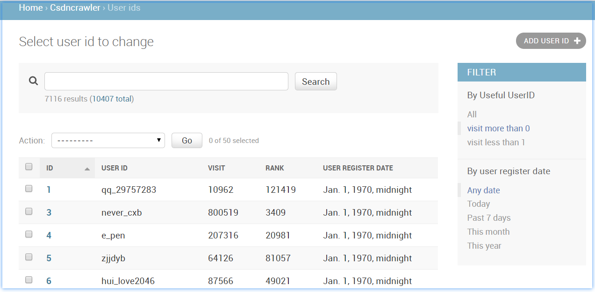
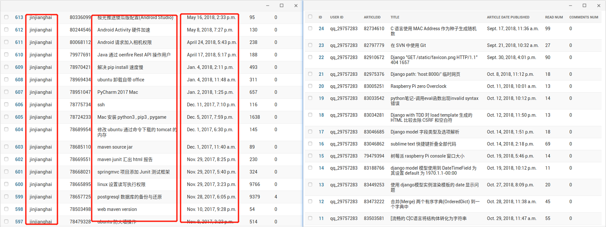
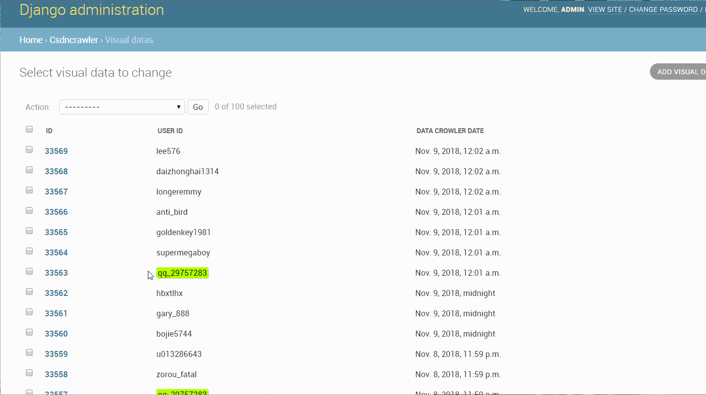
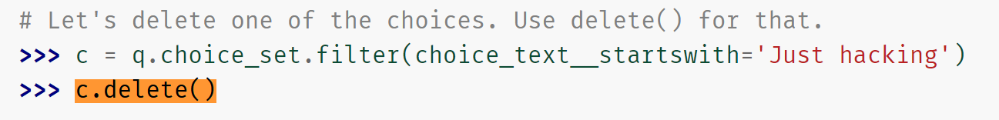
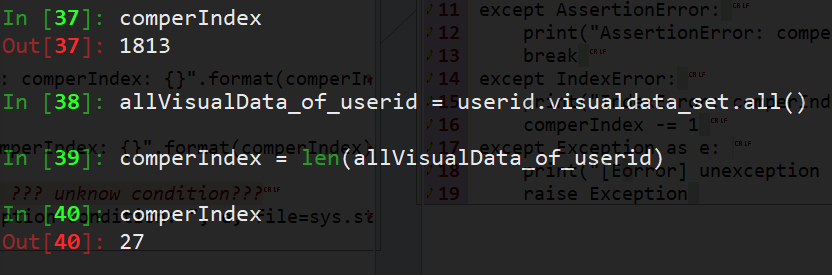

# v0.0.3 ArticleID 数据

  ArticleID 表对应 UserID 外键。ArticleID 表并非时间表。是储存唯一的 Article ID 信息。


## *Overview*

[TOC]

## Contents

  N/A

## Summary

N/A

## ToDo

- [ ] Article 表的”每一行“ 数据应当是唯一的，所以要做入库判断。

- [x] libCrawler 的 bug，daemonize 的 page source handler 可能出现 IPC refuse 的情况 -- 可能要加锁。

  -- IPC refuse 在 Crawler> CSDNv0.0.7 上 fix 了。使用 retry 机制。

- [ ] Article data 和 User Visual Data 应该并发处理（做多线程即可）（可能在保存数据库数据的时候要加锁处理）。

- [ ] 出了 IPC refuse 之外，timeout 的情况导致 page source 为“空”也要在 libCrawler 上面的开发解决掉。

- [ ] django Admin 后台管理 Articles 数据库页上显示文章 title 要作为一个 `<a href=...>` 可以跳转到 CSDN 原 blog 页面。

## Note

n/a


## Change Log (2018)

### Nov/05

#### 20:04 - django 后台管理自定义过滤器

因为 UserID 数据方面有不少没有的东西。比如那些没有发表过博客的 user-id，则请求 blog page 会出错，然后返回。这个时候 django 的 views.py 中的处理方式是直接略过，并不储存它的一些值。使用 `-1`。 所以通过排除 `-1` 就能过滤掉不需要的 user-id （当然，这里是指在后台管理页面显示查看方面）。

##### 添加过滤器

```python
class UserIDAdmin(admin.ModelAdmin):
    [...]
    list_filter=['register_date']

```

使用方式就是像这样添加一行 `list_filter` 即可。

但是因为要通过 `-1` 这个值来过滤比较特殊，这个位置的值从 -1，0，1，。。。99999... 是不分“段”的，所以直接这么使用它过滤明显是不能用的。

需要自己写一个过滤器

##### 自定义过滤器

follow django 的 Doc 

`url/<?>/ref/contrib/admin/index.html#django.contrib.admin.ModelAdmin.list_filter`

写出来如下过滤器（类），用起来还是不错的：

```python
from django.utils.translation import gettext_lazy as _
class UsefulUserIDFilter(admin.SimpleListFilter):
    title = _('Useful UserID')

    parameter_name = 'userfuluserid'

    def lookups(self, request, model_admin):
        return(
            ('useful', _('visit more than 0')),
            ('useless', _('visit less than 1')), )

    def queryset(self, request, queryset):
        if self.value() == 'useful':
            return queryset.filter(visit__gte=1,
                                   visit__lte=99999999999, )

        if self.value() == 'useless':
            return queryset.filter(visit__gte=-1,
                                   visit__lte=0, )

 class UserIDAdmin(admin.ModelAdmin):
    list_display = ('id', 'user_id', 'visit', 'rank', 'register_date')
    [...]
    list_filter=[UsefulUserIDFilter, 'register_date']
```

其中，`userfuluserid` 是用来作为 url 请求的 key，`useful/useless` 是作为 url 请求的 value。

看一下显示效果：



可以看到，用于用户点击的提示文本是在 `loopups(): ...` 中的 return 写的。


### Nov/16 - aticles 入库

#### 20:54 datetime 的使用

`datetime.datetime()` 可以赋值给 Artile.pub_date (which is `DateTimeField()`)。

不过对于时区上的事情需要注意，默认是 UTC 的，但是 django setting 了 `TIME_ZONE = 'Asia/Shanghai'` ，所以，赋值需要：

```python
import pytz
.pub_date = datetime(_year, _month, _day, _hour, _minte, _second,
                     tzinfo=pytz.timezone('Asia/Shanghai'))
```

一篇博客参考：[python时区设置——pytz模块](https://blog.csdn.net/shanliangliuxing/article/details/8557865)

如果没有注意时区，django 会提示：

> lib/python3.6/site-packages/django/db/models/fields/__init__.py:1421: RuntimeWarning: DateTimeField Article.pub_date received a naive datetime (2018-11-16 19:52:02) while time zone support is active.
>   RuntimeWarning)

从获取到的数据 string 到 django 的 datetime 可储存的转化：

```python
import pytz

def covert2DjangoDateTime(_strPub_date):
    # pub_data format: '2018-10-31 10:13:25'
    # defualt datetime(1970, 1, 1, 0, 0, 0)
    _date, _time = _strPub_date.split(' ')
    _year, _month, _day = _date.split('-')
    _hour, _minte, _second = _time.split(':')
    return datetime(int(_year), int(_month), int(_day),
                    int(_hour), int(_minte), int(_second),
                    tzinfo=pytz.timezone('Asia/Shanghai'))

### Usage:
newArticlesData.pub_date = covert2DjangoDateTime(v['pub_date'])

```

OrderedDict 的使用（倒序提取 items）：

```python
    while True:
        try:
            k, v = articlesInfo.popitem()
            newArticlesData = Article()
            newArticlesData.articleid = k
            newArticlesData.originality = v['originality']
            newArticlesData.title = v['title']
            newArticlesData.pub_date = covert2DjangoDateTime(v['pub_date'])
            newArticlesData.read_num = v['read_num']
            newArticlesData.comments_num = v['comment_num']
            newArticlesData.user_id = userid
            newArticlesData.save()
        except KeyError:  # pop until empty
            break
```

使用 `for k, v in articlesInfo.items(): ...` 也可以，不过是正序。

> 之所以关心顺序，是因为和储存在数据库中的顺序有关系。
>
> 我是希望数据库中的 db id 对应的同一个 user id 的所有文章，db id 往上增长对应的是 publish 时间往“现在”（后）增长。

还有一些 bug 写在了 TODO，比如 Article 这张表，对应的 article id 但是是期望唯一的，所以不应该出现重复添加用户的 article 进入的情况。


当前 articles data 入库效果：



-------


### Nov/17 删除无用（重复）数据

#### 10:28 

因为使用 `qq_29757283` 我的账号来做出现错误的时候默认爬取的账号，所以我的账号上现在打开很缓慢，有上千条 VisualData 数据，其中百分 90 以上应该都是相同的数据。

目前来看没有必要保存相同的数据，所以做这方面清理应该是需要马上操作的。

在 Admin 后台管理里面删除 VisualData 数据应该是算很简单的：



##### django 代码中如何删除某表中的一条数据？

Reference: [编写你的第一个 Django 应用，第 2 部分](https://docs.djangoproject.com/zh-hans/2.1/intro/tutorial02/#playing-with-the-api)



👆 这是 polls 应用程序的例子， `q` 是 Question。

##### 应用在 CSDN-Data project 上

我们可以使用： `userid = UserID.objects.get(user_id='qq_29757283')` 来等效于 `q`；

然后使用： `allVisualData_of_userid = userid.visualdata_set.all()` 来获取所有的的 VisualData 表中外键关联到该 `userid` 的数据。

> `len(allVisualData_of_userid) == 2180` 当前有 2180 条数据。

然后使用：

```python
comperIndex = len(allVisualData_of_userid)
while comperIndex:
    try:
        basis = allVisualData_of_userid[comperIndex]
        while True:
            comperIndex -= 1
            beComperedVisualData = allVisualData_of_userid[comperIndex]
            if beComperedVisualData == basis:  # 重写 VisualData 比较方法
                beComperedVisualData.delete()
            else:
                break
            
    except AssertionError:
        print("AssertionError: comperIndex: {}".format(comperIndex))
        break
    except IndexError:
        print("IndexError: comperIndex: {}".format(comperIndex))
        comperIndex -= 1
    except Exception as e:  # ??? unknow condition???
        print("[Error] unexception condition: ", e, file=sys.stderr)
        raise Exception
```

- [x] 重写 VisualData 的 `__repr__` 方法，在 `python manage.py shell` 中提供更多信息。

  ```python
  class VisualData(models.Model):
      [...]
      def __repr__(self):
          return "=" * 15 + '  user_id:  ' + '=' * 15 + '\n' + \
                 ' ' * 15 + "{!s}\n".format(self.user_id) + \
                 '-' * 42 + '\n' + \
                 "\tcrawlerDate: {!s}\n".format(self.crawlerDate) + \
                 "\toriginality: {}\n".format(self.originality) + \
                 "\tfans: {}\n".format(self.fans) + \
                 "\tlikes: {}\n".format(self.likes) + \
                 "\tcomments: {}\n".format(self.comments) + \
                 "\tcsdnlevel: {}\n".format(self.csdnlevel) + \
                 "\tvisitors: {}\n".format(self.visitors) + \
                 "\tintergration: {}\n".format(self.intergration) + \
                 "\trank: {}\n".format(self.rank)
  ```

- [x] 重写 VisualData 比较的方法

  重写之前：

  ```shell
  >>> allVisualData_of_userid[3]                  | >>> allVisualData_of_userid[2]
  ===============  user_id:  ===============      | ===============  user_id:  ===============
                 never_cxb                        |                never_cxb         
  ------------------------------------------      | ------------------------------------------ 
    crawlerDate: 2018-10-22 15:17:52.892600+00:00 |   crawlerDate: 2018-10-22 14:06:52.105943+00:00
    originality: 201                              |   originality: 201
    fans: 638                                     |   fans: 638
    likes: 149                                    |   likes: 149
    comments: 151                                 |   comments: 151
    csdnlevel: -1                                 |   csdnlevel: -1
    visitors: 793272                              |   visitors: 793272
    intergration: 8487                            |   intergration: 8487
    rank: 3396                                    |   rank: 3396
  
  >>> allVisualData_of_userid[2] == allVisualData_of_userid[3]
  False
  ```

  重写之后：

  ```shell
  >>> allVisualData_of_userid[2] == allVisualData_of_userid[3]
  True
  ```

  重写方法：

  ```python
  class VisualData(models.Model):
      [...]
      def __eq__(self, other):
          if not isinstance(other, VisualData):
              return NotImplemented
          # 调整比较顺序可能改善性能 - 但是目前先不考虑
          return str(self.user_id) == str(other.user_id) and \
                 self.originality == other.originality and \
                 self.fans == other.fans and \
                 self.likes == other.likes and \
                 self.comments == other.comments and \
                 self.csdnlevel == other.csdnlevel and \
                 self.visitors == other.visitors and \
                 self.intergration == other.intergration and \
                 self.rank == other.rank
  ```

数据清洗之后：



> 加上最近几天，30 次左右，难道是 CSDN 一天一更新？这一点从数据库中看是否有同一天的数据是不同的即可。
>
> 1813 是之前的 backup db.sqlite3 现在是上文的 2k+, 所以需要清理一下。

功能开发完成。 - 稍后简单做个页面用来激活即可（或者在 shell 中手动敲也行）。

<p align="right">2018/Nov/17 12:34</p>

### Nov/19 运行一天之后出现 bug

daemonize_use_threadpool.py 写的问题不少，log 文件达到 2.xG。

问题是：

```
Server Be Connected by ('127.0.0.1', 34186)at Sun Nov 18 16:45:07 2018
Traceback (most recent call last):
  File "/.../libCrawler/spider/daemonize_use_threadpool.py", line 495, in <module>
  File "/.../libCrawler/spider/daemonize_use_threadpool.py", line 410, in main
  File "/.../libCrawler/spider/daemonize_use_threadpool.py", line 403, in dispatcher
  File "/usr/lib/python3.5/socket.py", line 195, in accept
OSError: [Errno 24] Too many open files
[...]
Traceback (most recent call last):
  File "/mnt/sandi_TF/Devl/CSDN-Data_Nov05/CSDNVisualize/CSDNCrawler/libCrawler/spider/daemonize_use_threadpool.py", line 367, in server_handler
    client_conn = serv.accept()
  File "/usr/lib/python3.5/multiprocessing/connection.py", line 453, in accept
    c = self._listener.accept()
  File "/usr/lib/python3.5/multiprocessing/connection.py", line 593, in accept
    s, self._last_accepted = self._socket.accept()
  File "/usr/lib/python3.5/socket.py", line 195, in accept
OSError: [Errno 24] Too many open files
```

有问题的代码：

```python

def dispatcher():
    while True:
        connection, address = sockObj.accept()
        sys.stdout.write('Server Be Connected by {}'.format(address))
        sys.stdout.write('at {}\n'.format(now()))
        # threading.start_new_thread(handleClient, (connection, ))
        newIPCHandlerThread = threading.Thread(target=handleClient,
                                               args=(connection, ))
        newIPCHandlerThread.start()
dispatcher()

```

就是分别：

```
line 410 <---> 上面的 line 11
line 403 <---> 上面的 line 4
```

- [ ] 所以 `sockObj.accept()` 需要做一下处理！

#### 20:51 loop articles issue

loop articles 的代码写得不好。

现在需要手动删除在 shelve ALL_USER_IDs 中已经存入 articles 到数据库中的 user id。

```python
$ python manage.py shell
>>> import shelve
>>>
>>> shelve_db_path = "/mnt/sandi_TF/Plateform/database/follows_shelve"
>>>
>>> dbfp = shelve.open(shelve_db_path + "/" + 'UserID')
>>> all_user_ids = dbfp['ALL_USER_IDs']
>>>
>>> from CSDNCrawler.models import Article, UserID
>>> notFinishedId = []
>>> while True:
...     try:
...         userid = all_user_ids.pop()
...         user_id_obj = UserID.objects.get(user_id=userid)
...         if len(user_id_obj.article_set.all()) == 0:
...             notFinishedId.append(userid)
...     except IndexError:
...         break

>>> dbfp['ALL_USER_IDs'] = notFinishedId
>>> dbfp.close()
>>> exit()
$ 
```

#### 22:08 重启控制浏览器的 daemon

```shell
libCrawler $ /mnt/sandi_TF/Devl/CSDN-Data_Nov05/virtualenv/bin/python -O \
./spider/daemonize_use_threadpool.py start  ##### search here 20181119_2205
libCrawler $ /mnt/sandi_TF/Devl/CSDN-Data_Nov05/virtualenv/bin/python -O \
./main.py Articles "not be used"

```

测试了拿一个用户 articles 成功。

使用激活 django 测试：

浏览器打开 

`http://myrpiserver.com:8000/CSDNCrawler/loopArticles/?user_id=qq_29757283`

返回页面结果： **Already Exists**

#### 对于已经 loop 过 Articles 的 ID 处理

```python
def loopArticles(request):
    try:
        USER_ID = request.GET['user_id']
    except KeyError:
        [...]

    try:
        userid = UserID.objects.get(user_id=USER_ID)  # 该用法没有问题。
    except UserID.DoesNotExist:
        userid = UserID.objects.create(user_id=USER_ID)
    if doDebug:
        print("userid: ", userid)

    # -[x] 重复的就不要保存了！
    if len(userid.article_set.all()) != 0:
        return HttpResponse("<h1>Already Exists</h1>")
    [...]
```

22:35 调整了 loopCSDNCrawlerArticles.py 代码，两个线程分别只爬 100 个。

明天看看结果怎么样。


