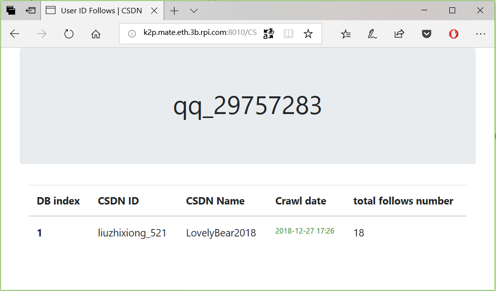

# GUI and DB API

在爬取微博数据保存这个项目上重新设计爬虫架构，和为了使用做了提取数据库数据的 API，获得了一些在本项目上可以继续往下一步的灵感。


首先进一步实现主页，主页要有一个 input 接口用于增加 targe（CSDN ID）。

然后设计一个“关注”表，同时提供这个表的 API，这样就能知道下一个 CSDN ID 要爬谁。

以及，当前数据库中的 CSDN ID 接口。


## *Overview*

[TOC]


## 主页

### bootstrapbase.html 模板

```html
{# CSDNCrawler/templates/visualize/bootstrapbase.html #}
<!doctype html>
<html lang="en">
  <head>
    <!-- Required meta tags -->
    <meta charset="utf-8">
    <meta name="viewport" content="width=device-width, initial-scale=1, shrink-to-fit=no">

    <link rel="stylesheet" media="screen"
        href="https://cdn.bootcss.com/bootstrap/4.0.0/css/bootstrap.min.css"
          integrity="sha384-Gn5384xqQ1aoWXA+058RXPxPg6fy4IWvTNh0E263XmFcJlSAwiGgFAW/dAiS6JXm"
        crossorigin="anonymous">

    <script src="https://cdn.bootcss.com/jquery/3.2.1/jquery.slim.min.js"
            integrity="sha384-KJ3o2DKtIkvYIK3UENzmM7KCkRr/rE9/Qpg6aAZGJwFDMVNA/GpGFF93hXpG5KkN"
            crossorigin="anonymous"></script>
    <script src="https://cdn.bootcss.com/popper.js/1.12.9/umd/popper.min.js"
            integrity="sha384-ApNbgh9B+Y1QKtv3Rn7W3mgPxhU9K/ScQsAP7hUibX39j7fakFPskvXusvfa0b4Q"
            crossorigin="anonymous"></script>
    <script src="https://cdn.bootcss.com/bootstrap/4.0.0/js/bootstrap.min.js"
            integrity="sha384-JZR6Spejh4U02d8jOt6vLEHfe/JQGiRRSQQxSfFWpi1MquVdAyjUar5+76PVCmYl"
            crossorigin="anonymous"></script>

    <title></title>

  


  </head>
  <body>
    
    
  </body>
</html>
```


### 继承模板加入 input 的主页

```html
{# CSDNVisualize/CSDNCrawler/templates/visualize/index.html #}


	User ID List | CSDN Crawler

  



<div class="container">
	<div class="row"><div class="col-md-12 col-md-offset-3 jumbotron">
		<div class="text-center">
		<h1>User ID List</h1></div>

		<br/>
		<form method="POST" action="#">
			<input id="id_new_crawl_target" name="new_crawl_target" 
					placeholder="Enter an {{ site.name }} 'id: <id> & name: <name>' to be crawled"
					class="form-control input-lg">

			
		</form>
	</div></div>

    <div class="row"><div class="col-md-12 col-md-offset-3">
		  [,,,]
	</div></div>
</div>


```

1. 增加了 line 15~22 的 form 部分；
2. 修改了格式以继承 bootstrapbase 模板


### 修改 CSDN User ID 表，增加"网名" name 字段

```python
--- a/CSDNVisualize/CSDNCrawler/models.py
+++ b/CSDNVisualize/CSDNCrawler/models.py
@@ -16,6 +16,8 @@ class UserID(models.Model):
     # email = EmailField()
     # birthday
 
+    name = CharField(max_length=64, default="")
+
     """here field just only for crawler priority"""
     visit = IntegerField(default=-1)
     rank = IntegerField(default=-1)
@@ -23,6 +25,9 @@ class UserID(models.Model):
     def __str__(self):
         return self.user_id
 
+    def __repr__(self):
+        return self.name
+
 
 class Article(models.Model):

```

#### 迁移

```shell
$ python manage.py makemigrations
Migrations for 'CSDNCrawler':
  CSDNCrawler/migrations/0005_userid_name.py
    - Add field name to userid
```


```shell
$ python manage.py migrate
Operations to perform:
  Apply all migrations: CSDNCrawler, admin, auth, contenttypes, sessions
Running migrations:
  Applying CSDNCrawler.0005_userid_name... OK
```


### add function

#### url

```python
app_name = 'csdn_crawl'
urlpatterns = [
    [...]
    #
    # DB API
    #
    path('userid/add/', views.userid_add, name='userid_add'),
]
```


#### input - HTML

```html
		<form method="POST" action="">
			<input id="id_new_crawl_target" name="new_crawl_target" 
					placeholder="Enter an {{ site.name }} 'id: <id> & name: <name>' to be crawled"
					class="form-control input-lg">

			
		</form>
```


#### Views function

```python
def userid_add(request):
    if request.method == 'POST':
        try:
            data = request.POST["new_crawl_target"]
            ''' data = json.loads(data) '''
            result = re.findall("^id: (.*) & name: (.*)$", data)
            if not request:
                raise Http404("wrong format")
            else:
                CSDN_UserID = result[0][0]
                CSDN_UserName = result[0][1]
                try:
                    objects = UserID.objects.all()
                    if CSDN_UserID not in [obj.user_id for obj in objects]:
                        UserID.objects.create(
                            user_id=CSDN_UserID, name=CSDN_UserName)
                        return redirect("/" + "CSDNCrawler/")
                except Exception as err:
                    import traceback; traceback.print_exc();
                    raise Http404("server busy")

        except Exception as e:
            import traceback; traceback.print_exc();
            raise Http404("no new_crawl_target data")

```


### update UserID table default register date

reference:

[CSDN blog - django model 模型的 DateTimeField 的一些使用细节]: [使用 标准库 datetime.datetime() 为该 Field 赋值 :link:](https://blog.csdn.net/qq_29757283/article/details/83188766)

```python
import pytz

class UserID(models.Model):
    user_id = CharField(max_length=64)
    register_date = DateTimeField(
        'user register date',
        default=datetime(1970, 1, 1, 0, 0, 0,
                         tzinfo=pytz.timezone('UTC')))
    [...]
```

增加了 line 7.

> 如果 `timezone("Asia/Shanghai")` 则这里的计算机元年应当 +8h 比较合理。


## Simple "follows" table


### 简单的解释图/关系图

```

user id 1  ---\
user id 2  ----> DB the user id
user id 3  ---/
~~~~~~~~~~
  ^^ follows  (by DB the user id)
```


### ORM follows table 设计

#### ORM

```python
class Follows(models.Model):
    followed_by = ForeignKey(UserID, on_delete=models.CASCADE)
    crawledDate = DateTimeField('follows crawled date', default=timezone.now)
    follow_id = CharField(max_length=64)
    follow_name = CharField(max_length=64, default="")

    #
    # more information, maybe useful someday
    #
    current_total_follows_num = IntegerField(default=-1)

    def str(self):
        return "{} followed by {}".format(self.follow_id, self.followed_by)

    def repr(self):
        return "{!r}".format(self.__dict__)

```

#### 迁移

```shell
$ python manage.py makemigrations
Migrations for 'CSDNCrawler':
  CSDNCrawler/migrations/0006_auto_20181224_1830.py
    - Create model Follows
    - Alter field register_date on userid
    - Add field followed_by to follows

$ python manage.py migrate
Operations to perform:
  Apply all migrations: CSDNCrawler, admin, auth, contenttypes, sessions
Running migrations:
  Applying CSDNCrawler.0006_auto_20181224_1830... OK
```

### DB API

#### detail - `/CSDNCrawler/userid/<pk>/follows/`

##### url

```python
[...]
urlpatterns = [
    [...]
    path('userid/add/', views.userid_add, name='userid_add'),

    # follows
    path("userid/<int:pk>/follows/",
         views.follows_detail_of_userid, name="follows_detail_of_userid"),
]
```


##### view

```python
def follows_detail_of_userid(request, pk):
    """ '/CSDNCrawler/userid/<pk>/follows/'
    """
    if request.method == 'GET':
        userid_obj = get_object_or_404(UserID, pk=pk)
        try:
            return render(request, "visualize/follows_detail.html",
                          {"userid_obj": userid_obj})
        except Exception:
            import traceback; traceback.print_exc();
            raise
```


##### front-display HTML(Template)

```html
{# visualize/follows_detail.hmtl #}



	User ID Follows | CSDN Crawler

  



<div class="container">
	<div class="row">
	<div class="col-md-12 push-md-3 jumbotron">
		<div class="text-center">
		<h1>{{ userid_obj.user_id }}</h1>
		</div>
	</div></div>

    <div class="row">
		<div class="col-md-12 push-md-3">
		<table name="id_list_table" id='id_list_table'
		       class="table table-hover">
		    <thead>
			<tr><th>DB index</th>
				<th>CSDN ID</th>
				<th>CSDN Name</th>
				<th>Crawl date</th>
				<th>total follows number</th></tr>
			</thead>

			<tbody>
		
			<tr><th scope="row">{{ each_follow.id }}</th>
				<td>{{ each_follow.follow_id }}</td>
				<td>{{ each_follow.follow_name }}</td>
				<td style="color: green; font-size: 12px">
					{{ each_follow.crawledDate |date:"Y-m-d H:i" }}</td>
				<td>{{ each_follow.current_total_follows_num }}</td>
			</tr>
		
			</tbody>
		</table>
		</div></div>
</div>

```


##### 手动输入字段测试 detail

```python
$ python manage.py shell
>>> from CSDNCrawler.models import UserID, Follows
>>> userid_obj = UserID.objects.get(pk=1)
>>> userid_obj.name = "RDpWTeHM"
>>> userid_obj.save()
>>> userid
"RDpWTeHM"
>>> userid_obj.follows_set.all()                                         
<QuerySet []>

>>> from django.utils import timezone
>>> now = timezone.now()
In [13]: data = {}                                                           

In [14]: data["followed_by"] = userid_obj                                    

In [15]: data["crawledDate"] = now                                           

In [16]: data["follow_id"] = "liuzhixiong_521"                               

In [17]: data["follow_name"] = "LovelyBear2018"                              

In [18]: data["current_total_follows_num"] = "18" 

>>> follow_obj = Follows()
>>> follow_obj.followed_by = userid_obj
>>> for k, v in data.items():
        setattr(follow_obj, k, v)
>>> follow_obj.save()
>>> exit()
$ python manage.py runserver
```

##### test detail page

`http://localhost:8000/CSDNCrawler/userid/1/follows/`




#### Crawl/Update - `/CSDNCrawler/userid/<pk>/crawl/follows/`

##### url

`http://localhost:8000/CSDNCrawler/userid/<pk>/crawl/follows/`

```python
[...]
urlpatterns = [
    [...]

    # follows
    path("userid/<int:pk>/follows/",
         views.follows_detail_of_userid, name="follows_detail_of_userid"),
    path("userid/<int:pk>/crawl/follows/",
         views.follows_crawl_of_userid, name="follows_crawl_of_userid"),
]
```


##### function in view

```python
def follows_crawl_of_userid(request, pk):
    """ '/CSDNCrawler/userid/<pk>/crawl/follows/'
    """
    if request.method == 'GET':
        userid = get_object_or_404(UserID, pk=pk)
        socialData_by_userid = personalProfile.SocialData(
            userid.user_id,  # browser_path not be used for now.
            browser_path='/opt/phantomjs/bin/phantomjs')
        follows = socialData_by_userid.getFollows()
        if __debug__:
            print("[Debug] id:{} getFollows: ".format(userid.user_id), follows,
                  file=sys.stderr)
        try:
            pass  # -[o] save to DB
        except Exception:
            import traceback; traceback.print_exc();
            raise
```


##### 运行测试是否能爬取 - 未保存到数据库

`personalProfile.SocialData()` 是之前的类，有一段时间没有用了，需要验证一下，然后看一下得到的输出是如何。再保存到 DB

```shell
libCrawler $ vim ../../conf/handler_pagesource.py
## 修改 MAX browser 为 1， 已经 time on logging filename
libCrawler $ ./spider/dae[TAB][TAB] start
.....
libCrawler $ cd ../
CSDNVisualize $ python manage.py runserver 0.0.0.0:8010
.....
```

browser: `http://localhost:8010/CSDNCrawler/userid/1/crawl/follows/`

###### 确实需要更新代码

1. personalProfile 不再使用，

   ```python
   from libCrawler.PersonalData.webpage import SocialData
   ...
   def ...(...):
       ...
       socialData_by_userid = SocialData(...
   ```

2. ~~SocialData 类需要更新代码！~~

   -- 初始化 SocialData 的时候，CSDN id 传递进去，不要传递 Models 的 UserID 的一个 object。

   即使用 `get_object_or_404(UserID, pk=pk).user_id` 传递进去 id。

###### 数据结果

```shell
[Debug] id:qq_29757283 getFollows:  \
{'shanliangliuxing': 'shanliangliuxing', \
'梦想橡皮擦': 'hihell', \
'<符号>安之若死': 'mp624183768', \
'zdcs': 'zdcs', 'LovelyBear2018': 'liuzhixiong_521', \
'Alpha_Fly': 'alpha_fly'}
```


##### 储存 follows 数据

```python
try:
    rsp_data = {}
    _f_d_in_DB = {_.follow_name: _.follow_id for _ in userid.follows_set.all()}
    for k, v in follows.items():
        if (k, v) in _f_d_in_DB.items(): continue  # skip
        f = userid.follows_set.create(
            follow_id=v, follow_name=k)
        # if __debug__:
        #     print("{!r}".format(f), file=sys.stderr)
        rsp_data[v] = [f.follow_name]
except Exception:
    import traceback; traceback.print_exc();
    raise
else:
    return HttpResponse("{}".format(rsp_data))
```

1. 使用到了字典推导

2. line 3 + line 5 实现判断是否在数据库中。

   先 `f = Follow()` ；再赋值元素，然后使用 `==` 判断（实现过了 `__eq__`）;最后不在数据库中再 `f.save()` 理论上也可以实现该效果（但是未测试）。

3. rsp_data 用于 HttpResponse （response 成 json 更好？）

   ```python
   from django.http import JsonResponse
   
   # line 15 \to/
       return JsonResponse(rsp_data)
   ```

   Reference:

   [Django之JsonResponse]: https://www.cnblogs.com/guoyunlong666/p/9099397.html

###### 更新爬取 follows 的数据清洗代码

**爬取到的数据保存格式：**

```python
follows of zubin006:
before clean data
 {'\n                            春暖花开_lv                        ': \
  'https://me.csdn.net/lvchunhua', \
  '\n                            ecjtuync                        ': \
  'https://me.csdn.net/ecjtuync', \
  '\n                            Nhsoft                        ': \
  'https://me.csdn.net/Nhsoft', \
  '\n                            aiirii                        ': \
  'https://me.csdn.net/aiirii', \
  '\n                            ccnp_Server                        ': \
  'https://me.csdn.net/ccnp_Server', \
  '\n                            就是一个                        ': \
  'https://me.csdn.net/onlyzhangqin'} 
```

**正确的清洗代码：**

```python
[...]
def clean_follows_userid_dict(tuple_kv_list):
    dict_ = {}
    for k, v in tuple_kv_list:
        k = k.replace('\n', '').replace(' ', '').replace('\r', '')
        v = v.replace('\n', '').replace(' ', '').replace('\r', '')
        # only user-id be needed, no need url:
        dict_[k] = v.replace(self.PERSONAL_HOME_PAGE_URL, '')
        return dict_

_ = [(k, v) for k, v in userfollowsDict.items()]
userfollowsDict = clean_follows_userid_dict(_)
```

**错误的清洗代码：**

```python
[...]
# user id must have not '\n', ' ', '\t' etc...
def clean_follows_userid_dict(dict_):
    for k, v in dict_.items():
        del dict_[k]
        k = k.replace('\n', '').replace(' ', '').replace('\r', '')
        v = v.replace('\n', '').replace(' ', '').replace('\r', '')
        # only user-id be needed, no need url:
        dict_[k] = v.replace(self.PERSONAL_HOME_PAGE_URL, '')
        return dict_

userfollowsDict = clean_follows_userid_dict(userfollowsDict)
```

这样清洗会导致“第一个” item 没有被处理到。

- [ ] TODO: 具体原因有待分析


#### Get - `/CSDNCrawler/userid/<pk>/get/follows/[<index>/]`

期望能够支持 后面跟 `/[<indec>/]`，但是处了写两个 url pattern，还不清楚如何再同一个中实现。

另外因为这个 `/follows/<index>/` 暂时不使用，所以没有实现。

##### url

```python
[...]
urlpatterns = [
    [...]
    path('userid/add/', views.userid_add, name='userid_add'),

    # follows
    path("userid/<int:pk>/follows/",
         views.follows_detail_of_userid, name="follows_detail_of_userid"),
    path("userid/<int:pk>/crawl/follows/",
         views.follows_crawl_of_userid, name="follows_crawl_of_userid"),
    path("userid/<int:pk>/get/follows/",
         views.follows_get_of_userid, name="follows_get_of_userid"),
]
```


##### function in view

```python
def follows_get_of_userid(request, pk):
    userid = get_object_or_404(UserID, pk=pk)
    try:
        data = {idx: {"id": _.follow_id, "name": _.follow_name, "t_total": _.current_total_follows_num}
                for idx, _ in enumerate(userid.follows_set.all())}
        return JsonResponse(data)
    except Exception:
        import traceback; traceback.print_exc();
        raise
```


### Make limit to Crawl Follows

因为 Follows 这个数据很长时间才会有变动。所以没有必要经常爬取。

暂时设定为至少 3 天才能更新一次

```python
class EasyDeltaDatetime():
    from datetime import datetime

    def __init__(self, dstDatetime, srcDatetime):
        self.dstDatetime = dstDatetime
        self.srcDatetime = srcDatetime
        self.computer_zero_datetime = datetime(1970, 1, 1, 0, 0, 0)
        self.calculate()

    def calculate(self):
        self.difference = self.dstDatetime - self.srcDatetime
        self.meta_datetime = self.computer_zero_datetime + self.difference

    def __getattr__(self, attrname):
        if attrname in ["year", "month", "day", "hour", "minute", "second"]:
            return int(getattr(self.meta_datetime, attrname) - getattr(self.computer_zero_datetime, attrname))

def crawl_follows(pk, pagesource=None):
    userid = get_object_or_404(UserID, pk=pk)
    f_all = userid.follows_set.all()
    if f_all:
        if EasyDeltaDatetime(
            datetime.now().replace(tzinfo=pytz.timezone("UTC")),
            f_all[len(f_all) - 1].crawledDate
        ).day < 3:
            return {"skip": "less than 3 days crawled"}
    [...]
```


## loop Follows by UserID in DB

```python
>>> import requests
>>> def gen_url(pk):
        return "http://localhost:8010/CSDNCrawler/userid/" + \
               str(pk) + "/crawl/follows/"
>>> _pk = 1
>>> r = requests.get(gen_url(_pk))
>>> while r.status_code != 404:
        _pk += 1
        r = requests.get(gen_url(_pk))
```

因为有许多 UserID 中的 “行”被删除（可能是一些没有价值的被我删除了？）

所以会出现 `get_object_or_404` 的情况。

需要对上面简单的代码做一点简单的更新

```python
[...]
>>> continuous_fail = 0
>>> while continuous_fail < 3:
        continuous_fail = continuous_fail + 1 if r.status_code != 200 else 0
        _pk += 1
        r = requests.get(gen_url(_pk))
```


## Reference

N/A