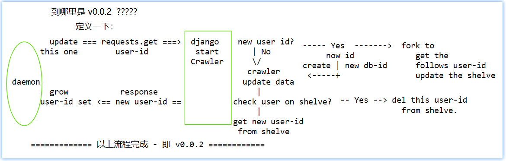

# Visualize Personal CSDN Data

  可视化个人的 CSDN 数据。

ex:

1. 分析发表的文章数量和用户排名，访问量的相关性。
2. 分析发表的文章数量和用户粉丝数量增长的相关性。
3. 分析发表的文章主题和访问量的相关性。

## *Overview*

[TOC]

## Contents

```
Visualize Personal CSDN Data
    Overview
    Contents
    Summary
```


## Summary



### Usage

干净的 source code of this project 开始：

> 本段落为开发 Crawler CSDN v0.0.5 之后撰写，因为在 CSDN 的爬虫程序 v0.0.5 上开发超过两周的时间，CSDN-Data 项目的开发有些遗忘。
>
> 本部分是为了整合 Crawler CSDN v0.0.5 的测试写的步骤。所以是完全没有数据库和其它调整的 source code 开始“部署”运行。

```shell
======== terminal 1 ===================
$ svn checkout url/Trunk/.../CSDN-Data
.......
$
$ cd <path>/<to>/CSDN-Data
CSDN-Data $ workon CSDN-Data  # 启动虚拟环境（假设已经安装过了）
(CSDN-Data) CSDN-Data $ cd CSDNVisualize
(CSDN-Data) CSDNVisualize $ python manage.py makemigrations
(CSDN-Data) CSDNVisualize $ python manage.py migrate
(CSDN-Data) CSDNVisualize $ 
(CSDN-Data) CSDNVisualize $ python manage.py runserver 0.0.0.0:8000
....

======== another terminal 2 ===========
$ cd <path>/<to>/CSDN-Data/CSDNVisualize/CSDNCrawler/libCrawler
libCrawler $ workon CSDN-Data
(CSDN-Data) libCrawler $ python ./spider/daemonize_use_threadpool.py start \
&& \
tail -f /tmp/daemonize_use_threadpool.log

.....

======= another terminal 3 =========
$ workon CSDN-Data
(CSDN-Data) $ ipython
## 为了方便，使用 ">>>" 代替 ipython 的 "[in]:"
>>> import requests
>>> r = requests.get(
    "http://localhost:8000/CSDNCrawler/startcrawler/?user_id=sinat_38682860")

## 查看上面打开的浏览器的行为是否正确。
## 也可以查看 terminal 2 的输出。

>>> 
>>> ## 使用浏览器打开 http://localhost:8000/CSDNCrawler/ 查看是否多了该 ID ##
>>> ## 可以点击进去查看是否有数据。 ##
>>> ## --------------------------------
>>> ## 从 admin 管理站点查看文章是否成功入库。
>>> 
```


