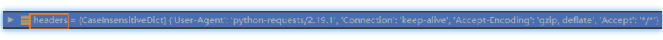
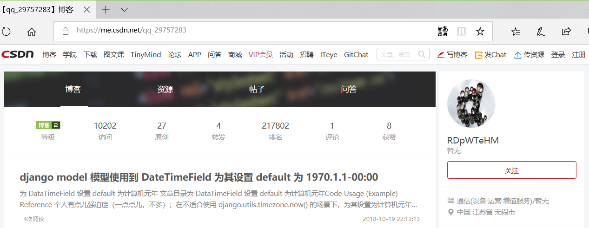

# README

reserve place

***Overview***

[TOC]

## Contents

  N/A

## Summary

N/A

## ToDo

- [x] 修改爬取 blog 用户主页为爬取 CSDN 用户主页。
- [x] 多进程分别爬取 CSDN 用户主页 和 CSDN 用户 blog 主页。
- [ ] 重构两个类 - 使用字典
- [x] UserData 得到的数据要适配准备给 django 的后台调用使用！


## Note

- 使用了 PhantomJS，不同平台使用时，要注意路径和平台版本问题！

  [Download PhantomJS]: http://phantomjs.org/download.html

- N/A

## Change Log(2018)

### Oct/21 星期日

#### 12:10 当前情况分析

1. 当前因为没有对 requests 调用优化，当前的请求request 头部：

   

2. 实际需要爬取的主页：

   

   点击“个人主页” 进入到的是如下网址：

   

   这里的访问量和排名，都是比较精确的数值。

3. 之前爬取的页面称为"博客主页"（<用户ID>的博客）。所以这里需要修改代码，原来的代码命名为另一个 类 即可。

#### 12:29 开始爬取“真正”的个人主页

先将之前的代码换个类名：

```python
-   class PersonCSDN(object):
+   class PersonBlogCSDN(object):
        [...]
```

然后基于原有的类名创建“新”的类代码：

```python
class PersonCSDN(object):
    r"""personal CSDN information.
    request packages support:
        requests, BeautifulSoup4

    Usage::
        >>> myCSDNinfo = PersonCSDN("qq_29757283")

    2018/Aug/26 CSDN “个人”主页 结构！
      HTMLData = getHTMLText("https://me.csdn.net/<UserID>")
      csdnSoup = BeautifulSoup(HTMLData, "html.parser")
      +--------------------------------------------------------------+
      |__CSDN__博客__学院__下载__。。。。。______________________________|
      | ______________________________________[搜索框] 写博客 。。 _____|
      ||     >>博客<<   >>资源<<  >>帖子<<  >>问答<<    |   头像         |
      || 等级    访问   原创   转发    排名   评论  获赞 |   <网名>        |
      |+-----------------------------------------------+   [简介]     |
      ||  <最后一篇发表的博客标题>                       |               |
      || 阅读量                           <最后修改时间> |  行业信息      |
      |+-----------------------------------------------+    地标      |
      ||  <最近发表的博客。。。>                           |  奖章       |
      || 阅读量                           <最后修改时间> |>粉丝< >关注<  |
      |+-----------------------------------------------+             |
      +--------------------------------------------------------------+
    """
    _id = ""  # CSDN user ID
    _hpHTMLData = ""  # Home Page HTML Data

    _articles = list()  # 文章数量  # 固定两个值 - 原创，转发 考虑使用其它内置类型。
    """#  ~~list~~ 内部是单独文章结构：
       #   文章名，阅读量， 评论， 点赞， 日期，“属性（分类）”
    """

    _fans = 0  # 粉丝
    _beLiked = 0  # 总 "喜欢"(点赞)
    _beCommented = 0  # 总 “评论”

    _beAccessed = 0  # 总访问量
    _membPoints = 0  # CSDN 积分
    _rank = 0  # 排名

    _doDebug = False
```

17:35 完成。

代码稍微有点儿长，有空整理的话再放上来。

#### 18:32 完整一下爬取的信息

真正的个人主页没有“积分”信息。但是有粉丝和关注的信息。

但是粉丝和关注都能在获取积分信息的时候拿到，所以，就不继续在个人主页上解析出来积分信息了。直接使用原来已经在 博客主页 上可以获取的 积分，粉丝，关注 三个数值信息。

```python
def _setUserDataInfo(self, userDataInfoTag):
    # doDebug = self._doDebug
    doDebug = False
    userDataInfoDict = dict()
    strictlyUserDataInfoTag = getSubTagfrom(
        userDataInfoTag,
        htmlClass=('ul', "mod_my_t clearfix"))
    for tagli in strictlyUserDataInfoTag.findAll('li'):
        userDataInfoDict[tagli.strong.string] = tagli.span.string
    # self._beAccessed = int(userDataInfoDict['等级'])
    self._beAccessed = int(userDataInfoDict['访问'])
    self._articles_number = (int(userDataInfoDict["原创"]),
                             int(userDataInfoDict["转发"]))
    self._rank = int(userDataInfoDict['排名'])
    self._beCommented = int(userDataInfoDict["评论"])
    self._beLiked = int(userDataInfoDict["获赞"])
    if doDebug: print("userDataInfoDict: ", userDataInfoDict)

    # membPoints, fans, follows
    blogHPInfo = PersonBlogCSDN(self._id)
    self._fans = int(blogHPInfo.fans)
    self._follows = int(blogHPInfo.follows)
    self._membPoints = int(blogHPInfo.membPoints)
    return True
```
注意到上面的 line 20 开始，调用了原本的 blog 主页获取信息 `blogHPInfo = PersonBlogCSDN(self._id)`

其中 粉丝 和 积分 都是可以获取到的。但是“关注”因为在 blog 主页上没有，所以是 -1 的值！

运行效果：

```shell
$ python main.py
user ID: qq_29757283
等级：None
原创：27
转发：4
访问量：10202
排名：217802
积分：391
总获赞：8
总评论：1
粉丝：3
关注：-1
$ 
```

接下来只要 commit，以及在 Django > CSDN-Data  中 merge 进去改动即可。

> 该源代码在 django 的环境下工作， `from attrdisplay import  AttrDisplay` 会有问题，必须使用
>
> `from .attrdisplay import AtrrDisplay` 而纯净的环境下（没有框架），使用的是前面的方式，两种方式在两种情况下都是只能这样的条件。换另外一种方式就不能工作，即使是写了 `__init__.py`文件。
>
> 这个方面还不太清楚。等慢慢了解到再解决。

<p align="right">2018/Oct/21 19:08</p>


### Oct/25

#### 01:28 尝试完善 request 模拟人

使用浏览器的 header 去请求反而有问题，大概是被判断为机器人，要验证 - 非 200。

使用 requests 默认的，header 是 python 信息，看起来 CSDN 是允许偶尔获取一下页面的。

所以这方面还需要进一步了解一个，怎么样才能让它认为就是人在操作。

> 应该就是和 cookie session 相关， sleep() 了 10s 也还是失败。

- [x] 待解决上述问题！！！

#### 19:09 uage PhantomJS fix above

使用 PhantomJS 无头浏览器解决了无法请求的问题。

当然，使用 selenium 调用了该浏览器。

效果：

```powershell
(CSDN) D:\NEW\code-repo\Crawler\CSDN\MyInfo_Visualization> python main.py
C:\Users\echis\.virtualenvs\CSDN\lib\site-packages\selenium\webdriver\phantomjs\webdriver.py:49: UserWarning: Selenium support for PhantomJS has been deprecated, please use headless versions of Chrome or Firefox instead
  warnings.warn('Selenium support for PhantomJS has been deprecated, please use headless '
start download image at time:  Thu Oct 25 19:08:17 2018
userDataInfoDict:  {'转发': '4', '排名': '206790', '评论': '1', '等级': None, '访问': '10351', '获赞': '9', '原创': '26'}
user ID: qq_29757283
等级：None
原创：26
转发：4
访问量：10351
排名：206790
积分：392
总获赞：9
总评论：1
粉丝：3
关注：-1
End download image at time:  Thu Oct 25 19:08:22 2018

(CSDN) D:\NEW\code-repo\Crawler\CSDN\MyInfo_Visualization>
```

单线程/进程耗时约 5 秒，等待会重构代码，使用多进程测试。

使用 selenium 调用 PhantomJS 方式：

```python
# import requests
from selenium import webdriver

# session = requests.Session()
browser = webdriver.PhantomJS(
    executable_path='C:/bin/phantomjs-2.1.1-windows/bin/phantomjs.exe')

class PersonBlogCSDN(object):
[...]
    def getHomePageHTMLText(self):
        try:
            browser.get(self.getHomePageUrl())
            return browser.page_source
        except Exception:
            ...
[...]

class PersonCSDN(AttrDisplay):
    [...]
    def getHomePageHTMLText(self):
        try:
            browser.get(self.getHomePageURL_by_UserID())
            return browser.page_source
        except Exception as err:
            print("产生异常：", err, file=sys.stderr)
            sys.exit(1)
    [...]
```

如此调用，获取源代码即可。

> 当前在 windows 平台下单独开发 CSDN 爬虫程序测试。使用的是 windows 的 PhantomJS，之后该爬虫程序以模块的形式 merge 到 ubuntu server 使用时，需要修改路径和在 ubuntu server 上放置 PhantomJS！！

<p align="right">2018/Oct/25 19:18</p>


#### 19:33 重构 for 多进程

> ~~一个用于*多进程化 function* 的类。~~
>
> ~~一个很适合被多进程化的一个类中的 function~~
>
> ~~创建一个上述类的实例，然后将该实例中的该 function 在多进程中运行一次。~~
>
> ~~该~~

1. 不要在实例化对象的时候采集完数据！

   ```python
   class PersonBlogCSDN(object):
       [...]
       def __init__(self, ID, doDebug=False):
           self._id = ID
           self._doDebug = doDebug
           if self._doDebug: print("running PersonBlogCSDN __init__", file=sys.stderr)
       [...]
       def syncUserData(self):
           self._hpHTMLData = self.getHomePageHTMLText()
           self._setUserInformation()
   
   class PersonCSDN(AttrDisplay):
       [...]
       def __init__(self, userid, doDebug=False):
           self._id = userid
           self._doDebug = doDebug
       [...]
       def _setUserDataInfo(self):
           csdnUserHPHTML = self._hpHTMLData
           [...]
       def _setMoreUserData(self):
           # membPoints, fans, follows
           blogHPInfo = PersonBlogCSDN(self._id, False)  # self._doDebug)
           blogHPInfo.syncUserData()
           [...]
       def syncUserData(self):
           self._hpHTMLData = self.getHomePageHTMLText()
           self._setUserInformation()
       [...]
   ```

   使用：

   ```python
       myCSDNInfo = PersonCSDN("qq_29757283", doDebug=True)
       myCSDNInfo.syncUserData()
       print(myCSDNInfo)
   ```

2. 重构获取用户信息的 class，因为反正都要分阶段完成，所以，就分得彻底一些！

   ```python
   class UserData():
       [...]
       def __init__(self, userid, doDebug=False):
           self._id = userid
           self.doDebug = doDebug
           self.user_homepage_data = PersonCSDN(self._id)
           self.user_blogpage_data = PersonBlogCSDN(self._id)
       def __getattr__(self, attrname): [...]
       def __str__(self): [...]
           def syncCSDNData(self):
           self.user_homepage_data.syncUserData()
           self.user_blogpage_data.syncUserData()
   
           # 访问量；原创文章数量，转载数量；排名；评论量；点赞量；
           self._csdnc_bloglevel = self.user_homepage_data.csdnLevel
           self._beAccessed = self.user_homepage_data.beAccessed
           self._articles_number[0] = self.user_homepage_data.originality
           self._articles_number[1] = self.user_homepage_data.repeat
           self._rank = self.user_homepage_data.rank
           self._beCommented = self.user_homepage_data.beCommented
           self._beLiked = self.user_homepage_data.beLiked
   
           # membPoints, fans, follows
           self._fans = int(self.user_blogpage_data.fans)
           self._follows = int(self.user_blogpage_data.follows)
           self._membPoints = int(self.user_blogpage_data.membPoints)     
   ```

   其中，`__getattr__` 增加了对转载文章数量获取的支持 "repeat"

   PersonCSDN 类中删除了（注释）粉丝，关注，积分等的信息；相当于这类信息目前就是从 blog 主页获取。

   使用：

   ```python
       myCSDNInfo = UserData("qq_29757283", doDebug=True)
       myCSDNInfo.syncCSDNData()
       print(myCSDNInfo)
   ```

3. 对 UserData 类增加快速函数 - 使用多进程！

   ```python
   class UserData():
       [...]
       def quikSyncCSDNData(self):
           manager = multiprocessing.Manager()
           return_dict = manager.dict()
   
           hp_pro = MyProcess(self.user_homepage_data.syncUserData,
                              (return_dict, ), "User Home Page", doDebug=True)
           bp_pro = MyProcess(self.user_blogpage_data.syncUserData,
                              (return_dict, ), "User Blog Page", doDebug=True)
           hp_pro.start()
           bp_pro.start()
   
           hp_pro.join()
           bp_pro.join()
   
           return return_dict
   ```

4. 调整两个获取页面信息的 class 中的 function， 使支持多进程的特性：

   ```python
       def syncUserData(self, return_dict=None):
           self._hpHTMLData = self.getHomePageHTMLText()
           self._setUserInformation()
   
           # support multiprocessing
           if return_dict is not None:
               # if isinstance(return_dict, dict):  # -[o] should be more precise!
               if True:  # -[o] 判断 return_dict 和 Manager().dict() 的方法还没有找到！
                   """ 三则重构！
                   -[o] 使用一个字典维护 "字符串", 和变量之间的关系
                       不！ 因为自己比较少用字典，所以倒是没有第一时间用！
                   ！！ class 内这些变量最开始就应该使用字典！！
                   """
                   return_dict['csdnLevel'] = -1
                   return_dict['beAccessed'] = self._beAccessed
                   return_dict["originality"] = self._articles_number[0]
                   return_dict["repeat"] = self._articles_number[1]
                   return_dict['rank'] = self._rank
                   return_dict['beLiked'] = self._beLiked
                   return_dict['beCommented'] = self._beCommented
               else:
                   print("PersonBlogCSDN> syncUserData> return_dict type ERROR!\n"
                         "Forget usage multiprocessing.Manager().dict() ?",
                         file=sys.stderr)
                   sys.exit(1)
   ```

   两个 class 支持的方式都是和上面类似的！

5. 调用多进程的快速函数：

   ```python
           myCSDNInfo = UserData("qq_29757283", doDebug=True)
           dict_ = myCSDNInfo.quikSyncCSDNData()
           print(dict_)
   ```

6. 最后！因为 PhantomJS 会被加载多次，位置放对了就能解决，以及，用完要退出：

   ```python
   from selenium import webdriver
   [...]
   class PersonBlogCSDN(object):
       [...]
       def getHomePageHTMLText(self):
           try:
               browser = webdriver.PhantomJS(
                   executable_path='C:/bin/phantomjs-2.1.1-windows/bin/phantomjs.exe')
               browser.get(self.getHomePageUrl())
               pagesource = browser.page_source
               browser.close()
               return pagesource
           except Exception:
               # print("request 失败， not 200！", file=sys.stderr)
               print("selenium get page source 失败， not 200！", file=sys.stderr)
               sys.exit(1)
   ```

从目前我在自己的笔记本上实验，使用了 PhantomJS 之后，单线程需要 15s 左右（这是指加入了两个类分别初始化 browser 以及退出的情况），而多线程需要 10s 左右。

当然，如果采集更多的页面，或者一个 class 对页面内容的分析工作增加，这个时候多线程的优势会更加明显。

<p align="right">2018/Oct/25 22:31</p>


#### 23:19 重构 for 调用

上面我们新增加了一个类为 UserData 在集中所有 CSDN-Data 需要的数据。而原来调用的是 PersonCSDN，如果使用的是单线程，基本上应该不会有差别。但是注意到，多进程版本，获取数据最后是放在了一个 dict 中。

所以，我们先看一下 CSDN-Data 原本是怎么调用的：

```python
def startcrawler(request):
    [...]
    myCSDNInfo = personalProfile.PersonCSDN(USER_ID, doDebug=True)
    [...]
    userid.visit = myCSDNInfo.beAccessed
    userid.rank = myCSDNInfo.rank
    userid.save()

    newVisualData = VisualData()
    newVisualData.user_id = userid
    newVisualData.originality = myCSDNInfo.originality
    newVisualData.fans = myCSDNInfo.fans
    newVisualData.likes = myCSDNInfo.beLiked
    newVisualData.comments = myCSDNInfo.beCommented
    newVisualData.csdnlevel = myCSDNInfo.csdnLevel
    newVisualData.visitors = myCSDNInfo.beAccessed
    newVisualData.intergration = myCSDNInfo.membPoints
    newVisualData.rank = myCSDNInfo.rank
    newVisualData.save()
```

可以看到，原版是期望实例化爬虫爬取 CSDN 类之后，可以直接使用点访问内部变量。

实际上，这里我的设计不对，这些变量实际上都是数据，数据应该放在 dict 中，使用键值对读取。

而需要传递信息，修改的变量，设计成类变量才比较合理。

------

在这里，我们首先知道，调用方式肯定是会改的，因为实例化的同时，类内部执行获取数据，set 数据有点儿不合理。

另外，由于现在单线程版本的 UserData 可以通过点的 getattr 方式获取，所以不过做太大的改动。

而多进程版本，最后能够得到一个字典结果，所以，我们还是就直接返回字典就可以了。后面 CSDN-Data program 那边，针对字典读取即可。

这么分析的话，我们的类中的数据形式和函数返回值等都无需修改。

但是，为了 CSDN-Data program 的调用，因为是在 Ubuntu Server 平台上，PhantomJS 的可执行程序和路径需要调整。

重构这一点为了不同平台上的调用！

```python
# 使用同级路径下的 phantojs/bin/ 文件夹下的 phantojs 应用程序作为默认
DEFAULT_BROWSER_PATH = './phantomjs/bin/'

if sys.platform == 'win32':
    DEFAULT_BROWSER_NAME = 'phantomjs.exe'
elif sys.platform == 'linux':
    DEFAULT_BROWSER_NAME = 'phantomjs'
[...]

class ...:
    def __init__(self, ID, browser_path=DEFAULT_BROWSER_PATH+DEFAULT_BROWSER_NAME, doDebug=False):
        self.browser_path = browser_path
    [...]
    def getHomePageHTMLText(self):
        try:
            browser = webdriver.PhantomJS(executable_path=self.browser_path)
        [...]
class UserData():
    def __init__(self, userid, doDebug=False,
                 browser_path=DEFAULT_BROWSER_PATH + DEFAULT_BROWSER_NAME):
        self._id = userid
        self.doDebug = doDebug
        self.user_homepage_data = PersonCSDN(self._id, browser_path=browser_path)
        self.user_blogpage_data = PersonBlogCSDN(self._id, browser_path=browser_path)
        
```

已经经过 Ubuntu Sever 和 windows 下的测试通过：

```python
def main(argc, argv):
    try:
        if argv[1] == 'single':  # single processing
            # 回归测试！
            [...]
        elif argv[1] == 'multi':
            myCSDNInfo = UserData("qq_29757283", doDebug=True,
                                  browser_path=argv[2])
            dict_ = myCSDNInfo.quikSyncCSDNData()
            print(dict_)
        else:
            print("only support multi/single")
    except IndexError as err:
        print("Usage: %s multi/single <phantomjs path>" % argv[0],
              file=sys.stderr)
        sys.exit(1)

    sys.exit(0)
```

ubuntu 下，将 phantomjs 移动到了 /opt 下，要注意权限问题, `$ sudo chown josephlin -R /opt/phantomjs/`; 这样当前是 josephlin 的登陆状态就能直接运行了。

```shell
tmp/ $ python personalProfile.py multi /opt/phantomjs/bin/phantomjs
tmp/ $
#########
>
> python personalProfile.py multi C:/bin/phantomjs-2.1.1-windows/bin/phantomjs.exe
>
```

<p align="right">2018/Oct/26 00:21</p>


