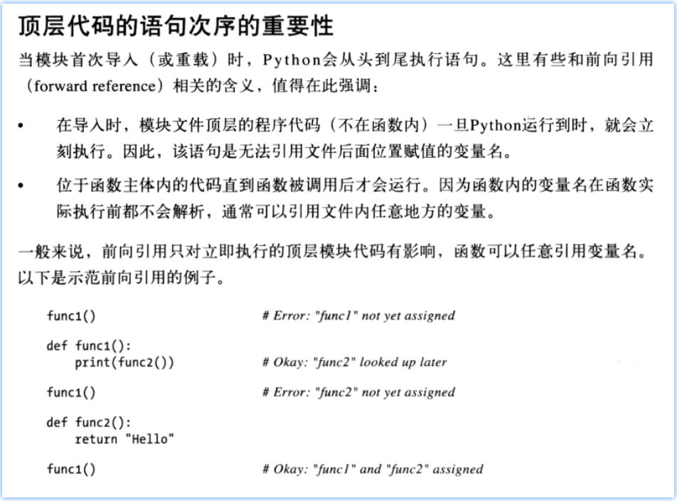
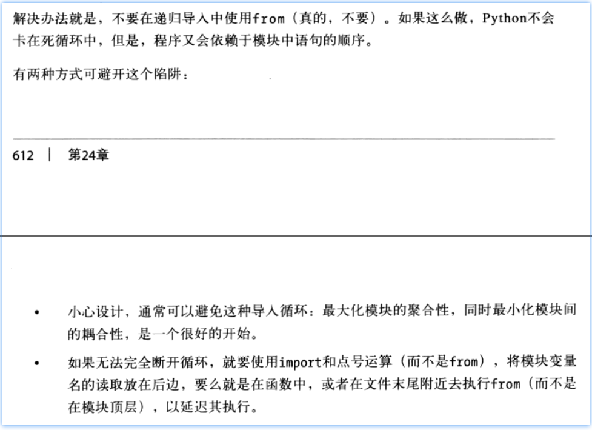

# Article Information

  v0.0.4

  爬取 blog 主页的文章信息（ article 的一级信息）

1. 文章 ID
2. 文章标题
3. 文章创建日期
4. 文章浏览量
5. 文章评论量

## *Overview*

[TOC]

## Contents

  N/A

## Summary

N/A

## ToDo

- [x] blog page > articles information > article date: 2018-11-02 14:20:18 格式转化为 python 日期格式（django 的 DateTimeField 要保存的格式）。这对这点写一篇博客。

  -- 这一点确实有点儿讲究。已经能够正确保存了。

  > [使用 标准库 datetime.datetime() 为该 Field 赋值](https://blog.csdn.net/qq_29757283/article/details/83188766#__datetimedatetime__Field__34)

  主要讲究在于 datetime 的时区上。


## Note

n/a


## Change Log (2018)

### Nov/03

#### 16:13 包，模块 的设计

* 转载文章：[转 Python类、模块、包的区别](https://blog.csdn.net/qq_29757283/article/details/83688065) 在 CSDN 上。

CSDN 爬虫包设计：

```
            包                模块               类
?                    ,-->  __init__.py
      setup.py       +--> utils.py
     PersonalData/ --+--> concurrence.py -----> MyProcess
      LICENSE.txt    +--> webpage.py     --+--> Page
      README.txt      `-> main.py          +--> HomePage
                                            `-> BlogPage
```

**当然，适当修改了一些内容！**

Q: webpage.py 是要作为 "module" 使用的，

1. 如果它不被用作 module 时的情况：`$ python webpage.py multi <browser path>` 那么是否使用本“包”目录下的其它 module 就必须使用 `from concurrence import MyProcess` 的方式？
2. 如果它确实被当作 module 使用的情况： `$ python main.py multi <browser path>` 那么使用本“包”目录下的其它 module 是否就必须使用 `from .concurrence import MyProcess`  的方式？

A: 上面的分析基本上是对的。还有一点儿问题。

当然，webpage.py 作为“包”的一部分，现在已经不适合作为直接运行的对象了，也就是不应该将 main() 写在其里面。但是，如果 main() 写在了 main.py 文件中，而 main.py 和 webpage.py 同级；那么 `from .con ...` 的方式还是不对的！只有 main.py 和 webpage.py 不在同一个文件夹中，`PersonalData/` 文件夹中的文件就是纯粹的 module 作用，那么就是使用 `from .concurrence import ...` 这样的方式使用。

为什么一定要使用 `from .module import class` 的方式？ 因为 package setup.py install 之后，import 它，这个时候，它作为 module 使用和它同 package 内同级的 module，使用 `from module import ...` 就会出错。

所以还不如一开始就写对！开发/测试 和 安装 都是使用 `from .module import class func` 的方式来使用同包内的其它代码。

> - [x] 本答案要写成 blog！ -- 一个很容易困扰新手的地方。
>
> [[Python] My SOP of Python 包编程](https://blog.csdn.net/qq_29757283/article/details/83746495)

“包”重构完成之后的测试：

```shell
(CSDN) echis@WorkandLearnning PersonalData
$ python webpage.py multi C:/bin/phantomjs-2.1.1-windows/bin/phantomjs.exe

start CSDN Data at time:  Sat Nov  3 17:51:16 2018

running PersonBlogCSDN __init__
Starting  User Home Page at:  Sat Nov  3 17:51:16 2018
Starting  User Blog Page at:  Sat Nov  3 17:51:16 2018
Finished  User Home Page at:  Sat Nov  3 17:51:40 2018
Finished  User Blog Page at:  Sat Nov  3 17:51:41 2018
{'fans': 1605, 'follows': -1, 'csdnLevel': -1, 'beAccessed': 636540, 
'beCommentd': 522, 'beLiked': 464, 'membPoints': 6618, 'originality': 1308, 
'rank': 5279,'repeat': 0}

End CSDN Data at time:  Sat Nov  3 17:51:41 2018

(CSDN) echis@WorkandLearnning PersonalData
$
```

目前还不需要真正作为“包”被调用，所以重构完成。

<p align="right">2018/Nov/03 18:00</p>


#### 20:52 使用 main.py 开发测试

* 需要将 main.py 移动”包”之外！！！
* 上面对于 `from .module import class` 和 `from module import class` 之间的区别基本正确。现在就在上面的位置写了 answer 更新。

具体改动看 revision + code 即可。


#### 22: 12 包内交叉 import issue

将 webpage.py 的 blog 相关部分移动到了一个新建的 blogpage.py 文件中，blogpage.py 的导包：

```python
import os, sys, io
from bs4 import BeautifulSoup
# import requests
from selenium import webdriver
from selenium.common.exceptions import WebDriverException

# import re
from time import sleep, ctime

# this packege part
from .utils import getSubTagfrom, cover_WANG_to_integet
from .webpage import Page
from .utils import *

[...]
```

在 webpage.py 中需要使用到 PersonBlogCSDN 类，所以：

```python
[...]
# this packege part
from .attrdisplay import AttrDisplay
from .concurrence import MyProcess

from .blogpage import PersonBlogCSDN
from .utils import *
[...]
```

运行时提示 line 6 的 `from .blogpage import PersonBlogCSDN` 中的 line 12 `from .webpage import Page` import 失败！

查看 *Learning Python* CH23 了解更多这方面编写的方式。

CH24 的 “顶层代码的语句次序的重要性” 中的 **向前引用** - 毫无疑问，上面遇到的问题就是这一个规则的原因：



针对上面的问题，书中也有一节专讲“递归形式的 from 导入无法工作”。



目前来讲，看来还是在 `webpage.py` 中使用 `PersonBlogCSDN` 类的前面再导入 `blogpage` 模块较好！

如此一来，问题就解决了！

<p align="right">2018/Nov/03 22:46</p>


### Nov/04 获取 aticle 信息

#### 13:10 ID, title, pub_date, etc...

##### 获取 title - 网站给正则表达式设下的陷阱

原字符串：

```
>>> str(articlesDivs[1].h4.a)
'<a href="https://blog.csdn.net/valada/article/details/83384628" ...
target="_blank">\n<span class="article-type type-1">\n            原        ...
</span>\n        Python 中最简最好的设计模式      </a>'
```

把上面的 `...` 删除并且在该位置按下 `[Delete]` 键，就是原本的输出，这里是为了阅读，手动使用 `...` 将长行分割换行。

因为存在 `\n` 的原因，所以直接使用 `re.findall(r'</span>(.*?)</a>', str(articlesDivs[1].h4.a))` 这种方式行不通！正则表达式可以匹配带有换行符的字符串，但是**正则表达式是按行匹配的**。

最终方案（直接去掉无用字符到提取最终想要的 title）：

```python
    title = re.findall(r'</span>(.*)</a>',
                       str(articlesDivs[1].h4.a).replace('\n', '')
                       )[0].strip().rstrip()
```

##### 获取 pub-date

原字符串：

```python
>>> articlesDivs[1]
<div class="article-item-box csdn-tracking-statistics" data-articleid="83384628">
[...]
<span class="date">2018-10-25 19:18:29</span>
[...]
</div>
```

获取：

```python
In [45]: articlesDivs[1].findAll('span', {'class': 'date'})
Out[45]: [<span class="date">2018-10-25 19:18:29</span>]

In [46]: list_ = articlesDivs[1].findAll('span', {'class': 'date'})

In [47]: list_[0]
Out[47]: <span class="date">2018-10-25 19:18:29</span>

In [48]: list_[0].string
Out[48]: '2018-10-25 19:18:29'

```

最终：

`pub_date = articleDiv.findAll('span', {'class': 'date'})[0].string`

##### 阅读数和评论数

原：

```
>>> articlesDivs[1]
<div class="article-item-box csdn-tracking-statistics" data-articleid="83384628">
[...]
<p>
<span class="read-num">阅读数：13047</span>
</p>
<p>
<span class="read-num">评论数：26</span>
</p>
[...]
</div>
```

方案：

```python
for read_num in articlesDivs[1].findAll('span', {'class': 'read-num'}):
    if "阅读" in str(read_num):
        read_num_ = re.findall(r'阅读数(.*)</span>',
                               str(read_num).replace("\n", '')
                               )[0].replace(":", '').replace("：", '').strip().rstrip()
    elif '评论' in str(read_num):
        comment_num_ = re.findall(r'评论数(.*)</span>',
                                  str(read_num).replace("\n", '')
                                  )[0].replace(":", '').replace("：", '').strip().rstrip()
```

最终代码：

```python
    read_num = -1; comment_num = -1
    for readnum in articleDiv.findAll('span', {'class': 'read-num'}):
        if "阅读" in str(readnum):
            read_num = re.findall(
                r'阅读数(.*)</span>', str(readnum).replace("\n", '')
            )[0].replace(":", '').replace("：", '').strip().rstrip()
            elif '评论' in str(readnum):
                comment_num = re.findall(
                    r'评论数(.*)</span>', str(readnum).replace("\n", '')
                )[0].replace(":", '').replace("：", '').strip().rstrip()
```

第一页面（暂不支持分页功能）的文章信息获取完成。

<p align="right">2018/Nov/04 14:12</p>


