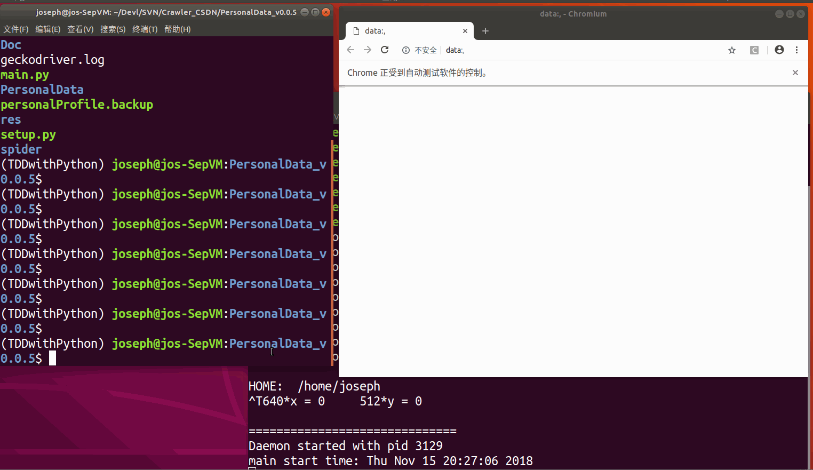

# daemon Handle Request Page Source by IPC

v0.0.5

为了做成节省资源，启动一个 daemon 在后台控制 4 个浏览器，总是运行。

通过 IPC 发送 request CSDN web page 任务，以及通过 IPC 接收 page source。

## *Overview*

[TOC]

## Contents

  N/A

## Summary

N/A

## ToDo

- [ ] selenium 浏览器清空缓存（隐身模式，更换 session，cookie）方法。

- [ ] 更多参数控制开关 --单/双线程；使用/禁用IPC方式；使用的浏览器种类。

- [x] 自动测试。

  -- 自动测试在 v0.0.6 中开发，虽然还没有做完整，但是已经和 v0.0.5 无关，这里标记可以去掉。

- [ ] 隐藏 bug: 没有清理普通和错误的输出 Queue，时间长了会增加内存占用。

- [x] 调用 daemonize**.py stop 的时候，不能关闭干净当前该进程。

  第一次似乎总是无效，第二次才生效。

  -- 考虑使用线程 command 'stop' 来清空线程和浏览器。

  -- daemonize demo 的命令行 'stop' 触发 SIGTERM 信号。daemon 捕获 SIGTERM 信号，调用 线程池 demo 的 `stop_and_free_thread_pool()` 函数使线程退出。

- [x] 经常**第一次** IPC 链接的时候，其中一个可以建立，另一个失败：`ConnectionRefusedError: [Errno 111] Connection refused` -- 可能是“锁”的原因。

  -- 在 v0.0.7 中，client（发布任务和解析 page source 的类库中） 使用 retry 机制解决。

- [ ] 隐藏 bug，同一个浏览器长时间请求。CSDN 站点会做 502 屏蔽。

- [ ] 隐藏 bug，获取 articles 信息，“都”会有一个 “帝都的凛冬” 这个文章（实际上它是不存在在爬取的user id上的），需要去除掉它。

## Note

n/a

## Change Log (2018)

### Nov/12 调试 daemon handle IPC 程序

#### 19:45 完成通过 IPC 发送 URL 以及获取 page source

一个在 `"...".format(var)` 写成 `"...",format(var)` 造成的 “Invalid format specifier” 调试惨案！

- [ ] 因为这次捕捉所有异常，却没有异常出现的行号，调试有很大问题 -- python 代码调试方法和打印行号。


### Nov/13 update Crawler CSDN

crawler CSDN data program use IPC to send mission to daemon for get page source.

#### 11:04 单线程 IPC mission 整合完成

OK - 出现了很多 bug。 11:04 单线程/进程 版本的 IPC 调试好了，至少不用开关浏览器，速度还行。

bug 一一道来：

- [x] 获取博客页面的时候，点击了 “关注” button，导致出现需要登陆窗口。

  -- 原因，之前获取 主页 的时候是需要点击“关注”来获取“关注”的用户ID 和 网名，这里没有做区分。IPC 发送的时候，可以用个字典附加一些信息，然后就可以在 daemon handle 里面区分。

- [x] 最严重的 bug，多个浏览器， page source 对不上号。

  -- 把 主页 的 page source 发过一次之后，又再一次发给本来应该是获取 blog 页面 的 page source。请求链接是对的。

  -- python 的函数内变量会向上查找。使用“browser” 而非“thisThreadBrowser” 来获取 pagesource，所以出了问题！！！

- [x] 性能 bug，daemon handle 在 IPC 方面不支持并发，导致多线程空设，只又一个线程在用。

  -- 使用了 多线程 socket 来 negotiate port - 从而可以建立多条 multiprocessing.connection 链接。

- [x] blog 页面加载时间较长，需要用上原来的在新标签中打开，检查元素加载完了就停止加载的 solution。

- [x] ~~隐藏 bug，同一个浏览器长时间请求。CSDN 站点会做 502 屏蔽。~~

  已移动到 TODO 位置。

当前 daemon handle 使用一个线程一个浏览器，能够工作。

client 发布获取 page source mission 的 IPC in time 获取 page source 和超时机制。

```python
from multiprocessing.connection import Client
c = Client(('localhost', 10086), authkey=b'CSDN-Data')
c.send(self.getHomePageURL_by_UserID())
# sleep(10)  # better solution? -- yes!
counter = 0
while True:
    pagesource = c.recv()
    if not pagesource:
        counter += 1
        if counter > 60:
            print("getHomePageHTMLText> connection timeout",
                  file=sys.stderr)
            sys.exit(1)
            sleep(2)
            else:
                c.close()
                return pagesource
```

当前测试和使用方式：

```shell
$ pwd
<path>/<to>/PersonalData_v0.0.5
$ 
$ ## 启动 daemon handle IPC mission
$ python ./spider/daemonize_use_threadpool.py start \
&& \
tail -f /tmp/daemonize_use_threadpool.log

$ ===== another terminal ============
$
$ ## 测试通过 IPC 获取 page source 然后解析出 data
$ python main.py single "any - not be used for now"
...
```

<p align="right">2018/Nov/13 11:26</p>

#### 23:39 多线程 IPC mission 整合完成

解决了上面描述的两个 bug。

1. 获取到的总是同一个页面 - 因为变量使用错误。
2. 多线程 IPC，server 能够响应多个请求 IPC 链接。


### Nov/14 

#### 10:46 稍微调整了一下代码

IPC client 发布请求页面 mission 的代码不同的页面，socket 和 IPC 部分的代码是相似的；所以调整到 utils.py

```python
### utils.py
[...]

from socket import *
import pickle

def negotiateIPCInfo():
    serverHost = 'localhost'
    serverPort = 50007
    msg = ['OK, give me the port number']

    sockObj = socket(AF_INET, SOCK_STREAM)
    sockObj.connect((serverHost, serverPort), )
    # sockObj.send(pickle.dump(msg[0]))
    sockObj.send(msg[0].encode())
    data = sockObj.recv(1024)
    data = pickle.loads(data)
    if __debug__:
        print('[Debug]: negotiateIPCInfo> Client received: ', data, file=sys.stderr)
    sockObj.close()

    return data

from multiprocessing.connection import Client

def getPageSourceOf(whichPage, _IPCData):
    c = Client(('localhost', _IPCData['port']), authkey=b'CSDN-Data')

    if whichPage == 'HomePage':
        c.send(_IPCData['req_url'])
        counter = 0
        while True:
            _pagesource = c.recv()
            if not _pagesource:
                counter += 1
                if counter > 60:
                    print("getHomePageHTMLText> connection timeout",
                          file=sys.stderr)
                    c.close()
                    sys.exit(1)
                sleep(2)
            else:
                c.close()
                return _pagesource
    elif whichPage == 'BlogPage':
        c.send(_IPCData['req_url'])
        counter = 0
        while True:
            _pagesource = c.recv()
            if not _pagesource:
                counter += 1
                if counter > 60:
                    print("getBlogPageHTMLText> connection timeout",
                          file=sys.stderr)
                    sys.exit(1)
                sleep(2)
            else:
                c.close()
                return _pagesource
```

当然，现在 getPageSourceOf() 函数里面的两个区分还是有很多的重复代码，但是还是有必要做区分，因为后面发送的 IPC data 会有不同。

获取 page source 的时候调用上面两个函数的目前两处使用：

```python
#### webpage.py
    def getHomePageHTMLText(self):
        if False: [...]
        else:
            # === negotiate the IPC port ===
            data = negotiateIPCInfo()

            IPCPort = data['port']
            """Use IPC, send mission to daemon
              which control the browser to get page source.
            """
            IPCData = {'port': IPCPort,
                       'req_url': self.getHomePageURL_by_UserID()}
            del data, IPCPort
            pagesource = getPageSourceOf("HomePage", IPCData)
        return pagesource

#### blogpage.py
    def getBlogPageHTMLText(self):
        if False:[...]
        else:
            # === negotiate the IPC port ===
            data = negotiateIPCInfo()

            IPCPort = data['port']
            """Use IPC, send mission to daemon
              which control the browser to get page source.
            """
            IPCData = {
                'port': IPCPort,
                'req_url': self.getBlogPageURL_by_UserID(),
            }
            del data, IPCPort
            pagesource = getPageSourceOf('BlogPage', IPCData)
        return pagesource
```

当前测试工作良好。

test code:

```shell
########## Terminal 1 - run daemon ########## || ######## Terminal 2 ##########
(virtualenv) u@h:PersonalData_v0.0.5$ python\ || (vir...) u@h:sameDir $
./spider/daemonize[TAB][TAB].py start \       || (vir...) u@h:sameDir $
&& \                                          || (vir...) u@h:sameDir $
tail -f /tmp/daemonize_use_threadpool.log     || (vir...) u@h:sameDir $
                                              || (vir...) u@h:sameDir $
Congratulations! ....                         || (vir...) u@h:sameDir $
### 当前代码出现两个 chrome 浏览器。              || (vir...) u@h:sameDir $
                                              || (vir...) u@h:sameDir $ \
                                              || python main.py multi "any"
                                              || 
                                              || >>>> I AM main.py <<<<<<<
                                              || Develop test by running me....
                                              ||
Ctrl+C                                        || [...这里显示结果...]
(virtualenv) u@h:PersonalData_v0.0.5$ \       ||
python ./spider/daem[TAB][TAB] stop           ||
```

(上述在软件中，不要打开 “代码自动换行” 选项)


#### 15:11 IPC 传递更多的信息

IPC 两个进程交互地传递信息，当然，也可以一次性地使用字典等类型直接传递全部信息。

目前是使用交互地方式。

对获取 blogpage 和 homepage 的行为做了轻微的区分。**这样获取 follows 就没有问题了**。

代码要点：multiprocessing.connection.Client() & multiprocessing.connection.Listener() 的 `.recv()` 是阻塞的。

一个 Listener() 的 `.accept()` 超时设定的参考：

[Raise TimeOutError after given time for multiprocessing.connection.Listener.accept()](https://stackoverflow.com/questions/45166547/raise-timeouterror-after-given-time-for-multiprocessing-connection-listener-acce)


#### 16:31 selenium 获取页面超时机制

虽然速度变快了，但是超时机制不管用！！！！

##### 这么setting 超时机制：

（目前在 CSDN 获取上是管用的）

```python
thisThreadBrowser = browserQ.get()  # this may block
thisThreadBrowser.implicitly_wait(30)
thisThreadBrowser.set_script_timeout(30)    # lower timeout can be easy to
thisThreadBrowser.set_page_load_timeout(30)
```

检查到 HTML ID 就 stop 的机制在此不管用！

##### 找到元素就停止加载：

```python
from selenium import webdriver
from selenium.webdriver.common.desired_capabilities import DesiredCapabilities
from selenium.webdriver.support.ui import WebDriverWait
from selenium.webdriver.support import expected_conditions as EC
from selenium.webdriver.common.by import By

capa = DesiredCapabilities().CHROME
capa["pageLoadStrategy"] = "none"

driver = webdriver.Chrome(desired_capabilities=capa)
wait = WebDriverWait(driver, 20)

driver.get('http://stackoverflow.com/')

wait.until(EC.presence_of_element_located((By.CSS_SELECTOR, '#h-top-questions')))

driver.execute_script("window.stop();")
```

Reference:

[How to make Selenium not wait till full page load, which has a slow script?]: https://stackoverflow.com/questions/44770796/how-to-make-selenium-not-wait-till-full-page-load-which-has-a-slow-script
[Wait until page is loaded with Selenium WebDriver for Python]: https://stackoverflow.com/questions/26566799/wait-until-page-is-loaded-with-selenium-webdriver-for-python
[“Eager” Page Load Strategy workaround for Chromedriver Selenium in Python]: https://stackoverflow.com/questions/51087832/eager-page-load-strategy-workaround-for-chromedriver-selenium-in-python

> 当前这个代码是有效的，不至于把代码变得更复杂。
>
> 但是如果遇到了不好使用的网页，使用自己写一个 iframe 的 html，通过 {{ jinja2 }} set src 为要爬取的页面，然后使用上之前在网易云音乐上面使用的 iframe 方法，理论上应该可行。

#### 20:19 main.py 加入 Articles 调试

```python
[...]
        elif argv[1] == 'Articles':
            csdn_userid_articles = PersonalArticles(
                'qq_29757283', browser_path=argv[2])
            csdn_userid_articles.syncArticlesData()
            print(csdn_userid_articles.articles)
        else:
            [...]
```

Usage:

```shell
(virtualenv) PersonalData_v0.0.5 $ python main.py Articles "not be uesed"
....
```

> `__debug__` 版本使用的是 Linux 下的 Chromium 浏览器。


#### 21:36 调整代码

调整了一下代码，虽然没有特别的作用。但是为了后面写起来更轻松

#### 23:19 Articles 使用 IPC 获取网页

完成了和之前通过自己调用 browser 获取 blog 主页解析出来 articles 一样的功能。

这次使用发送请求（任务）给 daemon 进程，其控制的浏览器获取网页了之后通过 IPC 返回给

`class PersonalArticles > getBlogPageHTMLsText()` 这里的调用方。

速度在 4~10s 之间。

当前只有第一页。

<p align="right">2018/Nov/14 23:24</p>


### Nov/15 all Articles by IPC

#### 16:07 完成开发 - 获取 blog page 的所有分页

要能够点击分页，必须要加载完一些必要的元素，根据上面 [找到元素就停止加载](#找到元素就停止加载：) - 因为 set 了 

```python
capa = DesiredCapabilities().CHROME
capa["pageLoadStrategy"] = "none"
```

所以，browser.get() 不会 block。这样就必须自己确保需要的元素被加载。

所以确认加载的代码更换：

```python
WebDriverWait(self.browser, self.timeout).until(
    EC.presence_of_element_located((By.CLASS_NAME, "ui-pager"))
)
```

分页（点击下一页）数量：

```python
_ = [class_page.text for class_page in self.browser.find_elements_by_class_name("ui-pager")]
MAX_PAGER = list()
for coverInt in _:
    try:
        MAX_PAGER.append(int(coverInt))
    except ValueError:
        pass
MAX_PAGER = max(MAX_PAGER)

for _ in range(MAX_PAGER - 1):  # first page had be loaded
    [...]
```

**即使是 class name 为：`js-page-next js-page-action ui-pager` 的元素，也会被包括在：**

**`self.browser.find_elements_by_class_name("ui-pager")` 返回的列表里面。**


当前获取 articles page sources 类的完整实现：

```python
class ArticlesPageSources(BlogPageSource):
    def __init__(self, _browser, timeout=30):
        super().__init__(_browser, timeout=timeout)

    def getPageSourcesBy(self, _url):
        '''_url is the first blog page '''
        page_sources = list()
        # page_sources.append(self.getPageSourceBy(_url))

        self.browser.get(_url)
        WebDriverWait(self.browser, self.timeout).until(
            EC.presence_of_element_located((By.CLASS_NAME, "ui-pager"))
        )

        _ = [class_page.text for class_page in self.browser.find_elements_by_class_name("ui-pager")]
        MAX_PAGER = list()
        for coverInt in _:
            try:
                MAX_PAGER.append(int(coverInt))
            except ValueError:
                pass
        MAX_PAGER = max(MAX_PAGER)
        if __debug__:
            sys.stdout.write("[Debug]: MAX_PAGER: {!r}\n".format(MAX_PAGER))

        for _ in range(MAX_PAGER - 1):  # first page had be loaded
            page_sources.append(self.browser.page_source)
            self.browser.execute_script("window.stop();")

            nextpage_tags = self.browser.find_elements_by_tag_name("li")

            for nextpage_tag in nextpage_tags:
                if __debug__:
                    sys.stdout.write(
                        "[Debug]: nextpage_tag.text: {}\n".format(nextpage_tag.text))
                if "下一页" in nextpage_tag.text:
                    nextpage_tag.click()
                    break
            time.sleep(0.5)
            WebDriverWait(self.browser, self.timeout).until(
                EC.presence_of_element_located((By.CLASS_NAME, "ui-pager"))
            )

        return page_sources

```
开发测试使用命令/代码和上面是一样的。

<p align="right">2018/Nov/15 16:19</p>

commit SVN 之前的最后效果测试：



------


