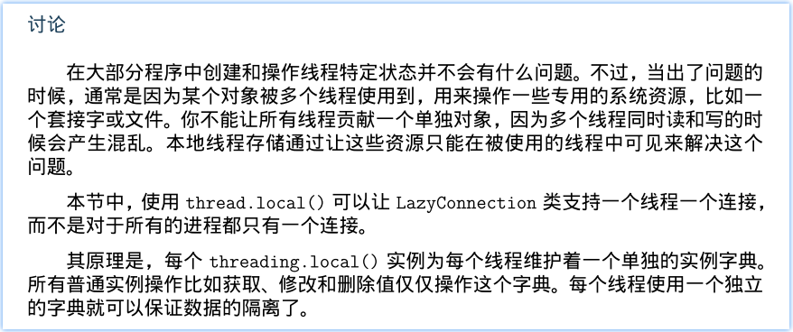

# Make Stable

这一版要不断地“内部”（其实也就我自己使用）运行和测试。然后 fix 掉不稳定的 bug。

适当重构代码，尽可能使程序耦合度更低。


## *Overview*

[TOC]

## Contents

```
Make Stable
    Overview
    Contents
    TODO
    Note
    Change Log(2018)
```


*daemonize_use_threadpool.py*

## TODO

- [ ] Socket 异常，`OSError: [Errno 24] Too many open files` -- 原因暂时未知！

- [ ] 对请求的站点分类，调整到独立文件中。IPC 指示了请求的站点，根据站点调用不同的类获取 page source。

- [x] Server 多线程内，IPC 建立链接 issue -- client 出现 server refuse 的情况。

  -- 使用了 retry 机制解决了问题。

- [ ] 发布 mission 的 client 在任务完成前中断了 IPC connection，server 不能停止正在运行中的 browser 请求。


## Note

reserve place.

## Change Log(2018)

Socket 异常：

```python
    def dispatcher():
        while True:
            connection, address = sockObj.accept()
            sys.stdout.write('Server Be Connected by {}'.format(address))
            sys.stdout.write('at {}\n'.format(now()))
            # threading.start_new_thread(handleClient, (connection, ))
            newIPCHandlerThread = threading.Thread(target=handleClient,
                                                   args=(connection, ))
            newIPCHandlerThread.start()
    dispatcher()
```

log:

```shell
Recv data=> b'OK, give me the port number' at Sun Nov 18 16:44:35 2018
browser timeout
Connection closed!
Server Be Connected by ('127.0.0.1', 34186)at Sun Nov 18 16:45:07 2018
Traceback (most recent call last):
  File "/[...]/libCrawler/spider/daemonize_use_threadpool.py", line 495, in <module>
  File "/[...]/libCrawler/spider/daemonize_use_threadpool.py", line 410, in main
  File "/[...]/libCrawler/spider/daemonize_use_threadpool.py", line 403, in dispatcher
  File "/usr/lib/python3.5/socket.py", line 195, in accept
OSError: [Errno 24] Too many open files
Recv data=> b'OK, give me the port number' at Sun Nov 18 16:45:08 2018
```

### Nov/22

#### Nov/23-01:19 将站点移动到独立文件中

类化站点请求。传递 browser 控制实例给类实例使用，控制 browser 获取 page source。

只需要提供 browser 的控制实例变量即可。和 daemon 的框架，结构，逻辑代码无关。所以这里应该要做分离。


### Nov/23

将启动多个浏览器换成多线程的方式来启动：

```python
    if sys.argv[1] == 'start':

        def startBrowser(i):
            [...]

        try:
            daemonize(PIDFILE,
                      stdout='/tmp/daemonize_use_threadpool.log',
                      stderr='/tmp/daemonize_use_threadpool.log')
        except RuntimeError as e:[...]

        '''setup browsers '''
        if __debug__:
            setupbrowser_threads = []
            for i in range(MAX_BROWSER_RUN):
                t = threading.Thread(
                    target=startBrowser, args=(i, ))
                t.setDaemon(True)
                setupbrowser_threads.append(t)
            for i in range(MAX_BROWSER_RUN):
                setupbrowser_threads[i].start()
            for i in range(MAX_BROWSER_RUN):
                setupbrowser_threads[i].join()
        else: [...]
```

#### 退出程序时关闭 browsers

将原本在 daemonize 函数中的注册信号，处理信号的函数和代码移动到 main 函数中。

增加了从队列中获取 browser 控制实例，`.quit()` 浏览器的代码。

虽然进程中还是会有 browser 控制的残留：

```shell
$ IDof chromium
...
joseph   15089 15070 15058 15058  0 14:57 ?        00:00:05 [chromium-browse] <defunct>
joseph   15093 15067 15058 15058  0 14:57 ?        00:00:05 [chromium-browse] <defunct>
joseph   15094 15071 15058 15058  0 14:57 ?        00:00:05 [chromium-browse] <defunct>
joseph   15095 15068 15058 15058  0 14:57 ?        00:00:05 [chromium-browse] <defunct>
...
$
$ kill -9 `pidof chromedriver`
```

这是僵尸进程，退出之后，主进程没有回收资源。


调整了代码顺序。将启动浏览器的代码放在 daemonize 之前，因为启动浏览器后，创建出来的“浏览器”本身进程的父进程是程序最开始，而程序 fork 了之后退出，这些原本父进程是程序最开始的子进程，就提交给了 init 管理。所以可以（巧妙）解决这个僵尸进程的问题。


#### 多线程 IPC server refuse issue

先编写测试复制这种情况！（压力测试）

四个任务，每个任务是普通的 quick User Data - 获取该信息，爬取 UserData 提供的类内部创建两个**进程**建立两个 IPC 链接。

但是目前即使是 四次 两个 IPC 链接，也没有办法复制出这个问题。

所以四个任务同时发起，建立 8 个 IPC 链接，复制出来了问题。

##### 测试代码（复制 issue）

```python
[...]
class ConcurrentTest(unittest.TestCase):
    """ 测试并发处理大多是以概率性出现的问题
    虽然是概率性出现的，但是程序应当不要让问题（概率性）出现，
    以及要正确处理当这类问题真的在考虑之外出现的时候。
    """

    def test_server_refuse_IPC_connection(self):
        from multiprocessing import Process
        missions = ['qq_29757283', 'jinjianghai', 'lizhe1985', 'valada']
        def handler_mission(user_id):
            myCSDNInfo = UserData(user_id, doDebug=True, )
            dict_ = myCSDNInfo.quikSyncCSDNData()
            print(dict_)

        processes = []
        for mission in missions:
            new_Process = Process(target=handler_mission,
                                  args=(mission, ), )
            processes.append(new_Process)

        for _process in processes:
            _process.start()

        for _process in processes:
            _process.join()
```

运行测试命令：

`$ python -m unittest tests.ConcurrentTest`

测试主要结果信息：

```
Process User Blog Page:
Process User Home Page:
Traceback (most recent call last):
  File "/home/joseph/Devl/SVN/Crawler_CSDN/PersonalData_v0.0.7/PersonalData/webpage.py", line 193, in syncUserData
    self._hpHTMLData = super().getHomePageHTMLText()  # 父类方法
  File "/home/joseph/Devl/SVN/Crawler_CSDN/PersonalData_v0.0.7/PersonalData/webpage.py", line 131, in getHomePageHTMLText
    pagesource = getPageSourceOf("HomePage", IPCData)
  File "/home/joseph/Devl/SVN/Crawler_CSDN/PersonalData_v0.0.7/PersonalData/utils.py", line 98, in getPageSourceOf
    c = Client(('localhost', _IPCData['port']), authkey=b'CSDN-Data')
  File "/usr/lib/python3.5/multiprocessing/connection.py", line 487, in Client
    c = SocketClient(address)
  File "/usr/lib/python3.5/multiprocessing/connection.py", line 614, in SocketClient
    s.connect(address)
ConnectionRefusedError: [Errno 111] Connection refused
```

一共有两个链接失败，server log 中可以看到建立了 8 个 socket 链接，但是进一步处理只有 6 个（“connection closed” 对应 IPC 出现六次）。

但是 server log 和预期的不太一样？原因是什么？？？？？？？

这个issue 导致的 server log 和最上面贴的情况不太一样，server log 出现异常的情况是协商过程中的 socket 错误。而这个复制的错误是 IPC 错误（`multiprocessing.connection.Listerner/Client`）。

> 目前 log 信息和机制还不够完善，先勉强用来分析分析。
>
> client（测试）和 server 的 log 分别放在了 
>
>   `res/log/serverIPC-refuse-issue_Client_Nov23-2018_1050.log` 和
>
> `res/log/serverIPC-refuse-issue_Server_Nov23-2018_1050.log` 中。


##### Expect

1. Client 应当考虑到这类问题的出现，并且合理“记录”以及最后的退出。
2. Server 不应该发生这种情况，除非是系统资源确实耗尽了之类的时候。应当保证该有的 IPC 链接都要正常建立。

目前 client 对于失败的请求数据，比如 blog page 请求被 refuse，就会缺少积分项。

可以根据这个 :point_up_2: 来实现 TestCase 中成功或失败的判断。

##### Solution

Server 端的预期 solution：



> Python3 cookbook &12.6

看起来使用这个方式没有解决问题 - server 控制4个浏览器，client 发起 8 个 missions *2 = 16 个 IPC 链接。还是出现了问题。


这个问题挺无解的。从多线程的加锁或其它方式是解决不了的，或者说，加锁只解决了一半。

因为建立连接的过程中可能会被中断，导致建立链接失败，可以通过加锁，确定不会被中断链接。

但是如果获取不到锁的这个时刻，client 请求建立链接，就会出现一样的 refuse 情况，这个时候 client 可以再次尝试，这样组合成一个 solution。

另一种方案就是，在线性的情况下，建立链接肯定是没有问题的（后续可以抽象出这个 case 的简单代码来测试），所以可以考虑使用 异步server 的方式来处理 client 请求。

###### ~~加锁和~~重试

现在来进行第一种方案。

client 链接失败的异常：`ConnectionRefusedError`

client 重复尝试代码：

```python
#### filename: PersonalData/utils.py
[...]
def getPageSourceOf(whichPage, _IPCData):
    MAX_RETRY_TIMES = 4
    for failTimes in range(MAX_RETRY_TIMES):  # 尝试 MAX_RETRY_TIMES 次链接 IPC。
        try:
            c = Client(('localhost', _IPCData['port']), authkey=b'CSDN-Data')
        except ConnectionRefusedError as e:
            print("[Info] ConnectionRefusedError: ", e)
            if failTimes == MAX_RETRY_TIMES - 1:  # 第 MAX_RETRY_TIMES 次链接失败
                import traceback; traceback.print_exc()
            time.sleep(1 * (failTimes + 1))
        else:
            break
    recv_result = False
    if whichPage == 'HomePage':
        [...]
```

使用重复尝试的 solution 就可以直接解决问题，目前较稳定！


### Nov/28

#### 12:14

随机生成的 port 有可能冲突，造成 `OSError: [Errno 98] Address already in use` 的 Exception，

考虑这个 Exception 进入代码，log error(warning) 它。让 client retry 失败就可以。


